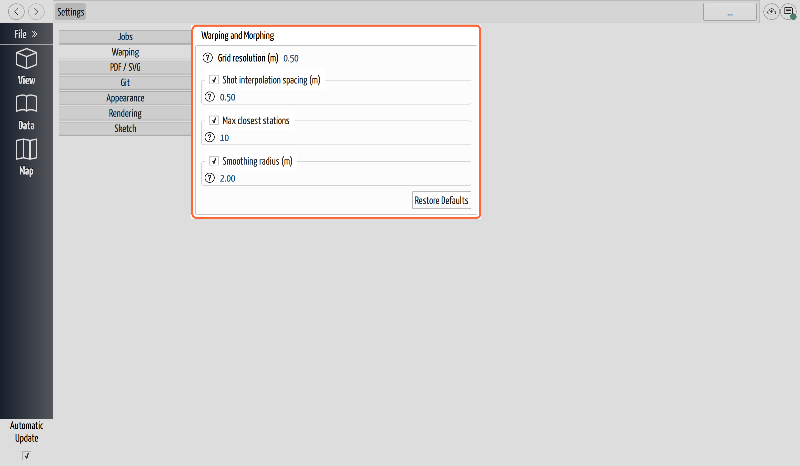
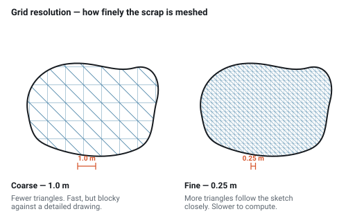
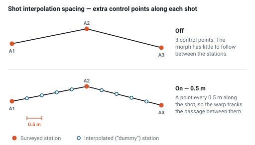
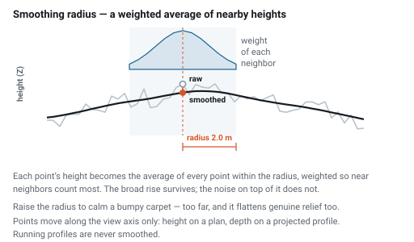

# Tune the Warping Settings

## Why / when you need this

Carpeting has 4 knobs that trade **detail against performance and smoothness**.
The defaults suit most caves, so reach for these only when a carpet looks blocky,
wobbles, or takes too long to recompute on a big project. All 4 sit in one box
under **File → Settings… → Warping**, shown below, and feed the mesh and the
morph described in
[Scraps and Carpeting](carpeting.md#what-carpeting-actually-does).

> **These settings are global.** CaveWhere keeps them per machine, in your
> preferences under `TriangulateWarping`, not in the project file. They apply to
> every cave you open on this computer, they don't travel with a project you
> share, and changing any one of them re-morphs every scrap you have.

*The Warping and Morphing settings. Each control trades detail or stability
against performance.*

Two of the 4 multiply into each other, as the next 2 sections show. **I recommend
changing one at a time**, on a scrap you already know well. Change 2 at once and
you can't tell which one moved the carpet.

## Grid resolution (m)

Sets the spacing of the triangulation grid laid over each scrap. CaveWhere
measures the scrap's footprint in the cave, divides each side by this spacing,
and morphs the triangles that land inside your outline. That decides how finely
the carpet can follow your drawing.

*Grid resolution is the spacing between grid points. Halving it roughly
quadruples the triangles, so detail and cost rise together.*

The 2 grids shown above cover the same outline at 1.0 m and 0.25 m. **Smaller
values increase detail but add more triangles.** The spacing divides both axes,
so the count climbs with the square. Lower it when a carpet looks blocky against
a highly detailed drawing; raise it to speed up a heavy project.
Default **0.5 m**.

CaveWhere caps the grid at **2048 points per axis**. You should never reach that
on a real drawing. If you do, check the scale first, under
[the carpet is the wrong size](troubleshoot-carpeting.md#the-carpet-is-the-wrong-size).

## Shot interpolation spacing (m)

Controls how densely CaveWhere inserts extra "dummy" stations along survey shots
to guide the morph. Your surveyed stations can sit tens of meters apart, and
between them the morph has nothing to hold onto. Interpolation fills that gap: it
walks each shot at this spacing and drops a control point at every step, as shown
below. Each one lands on the drawing and in the cave alike.

*Interpolation adds control points along each shot at the chosen spacing. A shot
no longer than the spacing gets none, since it already has a station at each
end.*

Three limits are worth knowing before you lean on it:

- **A shot at or under the spacing gets no dummy stations at all.** CaveWhere
  measures the shot in the cave, not on the page, so a tight cross-passage of
  short shots stays as sparse as you drew it.
- **The dummies sit on the straight line between the 2 ends**, on the page and in
  the cave both. Draw a shot as a curve and its control points won't follow the
  curve.
- **CaveWhere only interpolates between 2 stations you drew on this scrap** that
  the survey also lists as neighbors. A shot with one end off the scrap
  contributes nothing.

**Smaller spacing gives smoother warps but costs performance,** because the morph
has more control points to weigh. Default **0.5 m**, on. Clear the checkbox and
you're back to the stations you drew, wherever you drew them.

## Max closest stations

The number of nearby stations considered when warping each point. CaveWhere sorts
the control points by their distance **on the page** and keeps this many nearest
ones to bend that part of the drawing.

**It counts the interpolated stations too**, not just the ones you surveyed. It
runs over the same list [shot interpolation](#shot-interpolation-spacing-m) just
filled in, and interpolation normally supplies the great majority of the
candidates. With the defaults, most of the 10 nearest will be dummy points. How
many surveyed stations land among them depends on how long your shots are: in
the figure below, 5.5 m shots put exactly one in range. They can easily be *all*
dummies.

*The candidates are mostly interpolated points strung along the shots, so the
nearest few are a short run of line either side of the point, not a scattering of
surveyed stations from across the cave.*

So the 2 settings multiply into a **reach**, marked on both halves shown above.
At the default 0.5 m spacing, 10 points span roughly **5 m of surveyed line**, a
couple of meters either side of the point. That's the neighborhood each part of
your drawing gets fitted to. Halve the spacing to 0.25 m and the same 10 points
reach only about 2.5 m, tighter and more local. Change either setting and the
other changes character with it.

Clear the checkbox and CaveWhere uses every control point in the scrap: all the
stations you drew, plus every dummy interpolation added. Using all the stations
is what it did before the cap existed, and the
[carpeting article](https://cavewhere.com/2020/12/16/sketch-carpeting-behavior-and-troubleshooting/)
names both sides of that:

> Using all the stations makes the warping continuous and prevents unappealing
> discontinuous steps in the results. The main drawback to using all the stations
> is that unrelated stations can affect the final morphed result. This is
> particularly apparent in the elevation of a plan morph.

The cap bounds that drawback. CaveWhere's own help puts it from the other end:
**"More stations can stabilize the warp but may flatten sharp features."** More
keeps the warp continuous; fewer keeps unrelated stations out of it.
Default **10**, on.

Which way to turn it depends on the failure you have. The localized bumps a plan
carpet shows *are* the drawback in that quote, so **lower the cap** to cut them.
[Choose the right scrap type](troubleshoot-carpeting.md#choose-the-right-scrap-type)
covers the rest of that fix. A carpet that ripples or steps between stations
wants the cap raised instead.

One wrinkle the help text doesn't mention. It says "in plan view", but projected
profiles run through the same selection. Running profiles never reach it: they
warp each point between the 2 stations it falls between along the page, so the
cap has nothing to choose from.

## Smoothing radius (m)

Applies Gaussian smoothing along the scrap's own view axis over this radius to
**reduce surface noise**. Every point within the radius contributes to a point's
new position, weighted so the nearest count most, as the bell curve below shows.
The weighting falls off over half the radius, then stops dead at the edge instead
of fading out.

*Smoothing averages heights within the radius. The broad, real relief survives;
the noise riding on top of it does not.*

Raise it to calm a bumpy carpet; lower it to preserve genuine relief. Which way a
point moves depends on the scrap type. On a plan the view axis is elevation, so
only the height changes. On a projected profile it's distance from the projection
plane, so the point shifts toward or away from that plane instead.
**Running profiles are never smoothed**, so this setting does nothing to them.
Default **2.0 m**, on.

Smoothing is the only stage that grows with the square of the point count.
CaveWhere compares every point in a scrap against every other point, and the
grid resolution above sets that count. A fine grid and a wide radius together
make a large scrap slow to recompute.

## Restore the defaults

**Restore Defaults** puts all 4 back to the values above and re-ticks all 3
checkboxes, so a setting you deliberately turned off comes back on. The button
grays out once you're already there, so it doubles as a read-out of whether
you've changed anything.

## Where to go next

- Understand what the grid and morph do: [Scraps and
  Carpeting](carpeting.md#what-carpeting-actually-does).
- Still fighting a distorted carpet? See [Troubleshoot the
  carpet](troubleshoot-carpeting.md).
