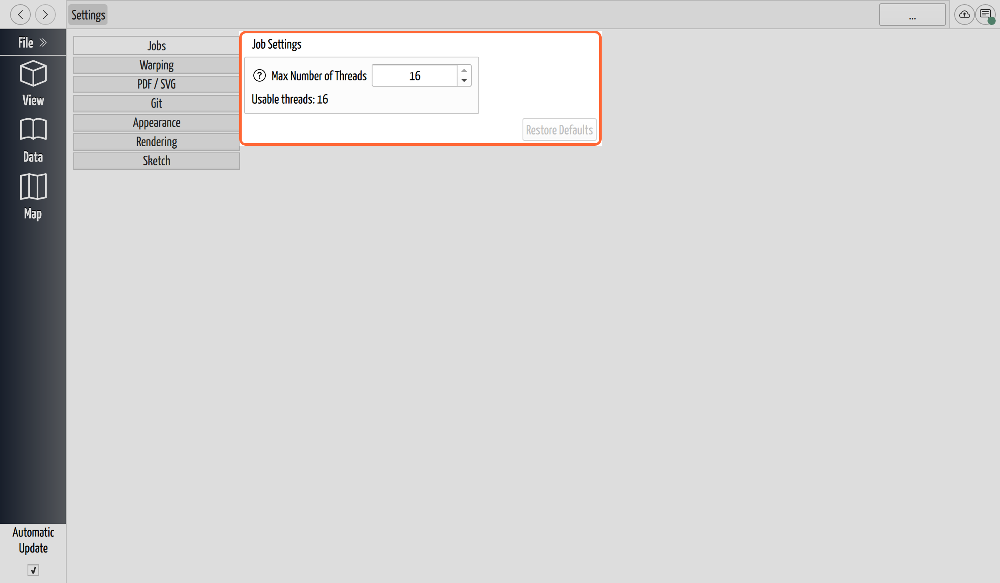
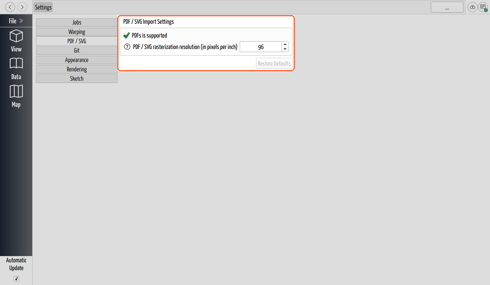
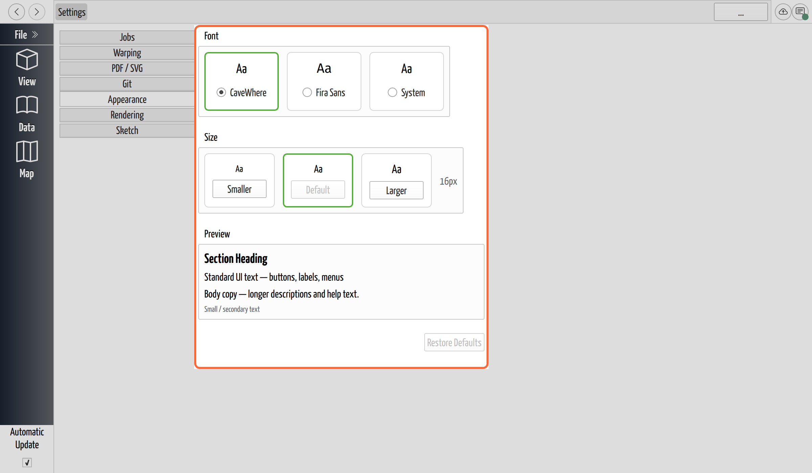
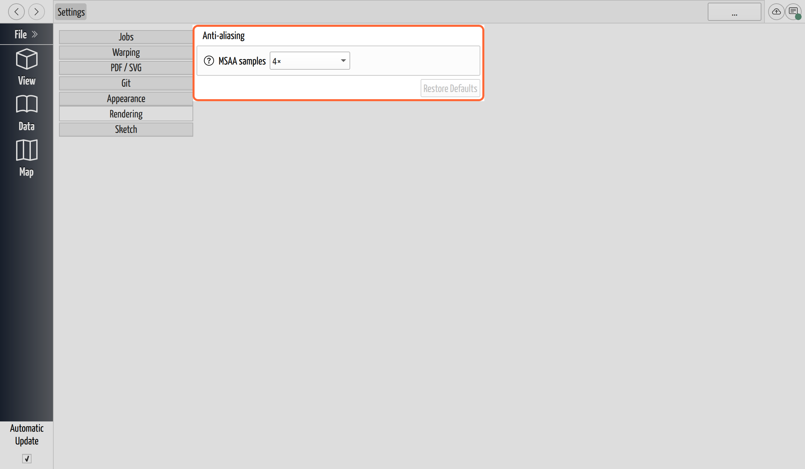

# Change CaveWhere's Settings

## Why / when you need this

CaveWhere's defaults are chosen to be right for most people on most machines, so
Settings is somewhere you go for a *specific* reason: the fans spin up while
CaveWhere works, an imported PDF looks soft when you zoom in, the interface text
is too small on a high-resolution screen, or the 3D view's edges look jagged.
Each of those is one control away.

The important thing to know first is what Settings is *not*: these are your
preferences for CaveWhere **on this computer**, stored alongside the app and not
inside any project. So they apply to every cave you open here, they don't travel
with a project you hand to someone else (their CaveWhere uses their own
settings), and changing one never edits or risks your survey data — nothing here
is part of the cave.

## Open Settings

Open **File → Settings…** (the File menu is in the macOS menu bar on macOS, and
the File button at the top of the sidebar on Windows and Linux). Settings opens
as a page with a list of tabs down the left and the selected tab's controls on
the right. This page covers four of the tabs — **Jobs**, **PDF / SVG**,
**Appearance**, and **Rendering**; the other two, **Warping** and **Git**, have
their own chapters (see below).

*Settings is a page, not a pop-up dialog. The tabs down the left switch between
groups of preferences; each group has its own Restore Defaults button.*

A few things are true across every tab:

- **There is no OK, Apply, or Cancel.** A change takes effect the moment you make
  it, and it's saved as you go — you just close the page when you're done.
- **Each tab has its own *Restore Defaults* button**, which resets only that tab
  and is greyed out when the tab is already at its defaults, so it doubles as a
  reminder of whether you've changed anything.
- **The small "i" buttons open in-place help** — the same explanations
  summarized below, from inside the app.

Two of the tabs are covered elsewhere in this manual, because they belong to a
task you meet before you ever open Settings:

- **Git** holds your **identity** (the name and email that sign your saves) —
  see [Set Up Your Identity](../getting-started/set-up-your-identity.md).
- **Warping** tunes how sketches morph onto the survey — see
  [Tune the Warping Settings](../scraps/warping-settings.md).

The rest of this page covers the other four tabs.

## Cap the worker threads (Jobs)

CaveWhere does its heavy work — recomputing carpets, solving the survey network,
loading point clouds — on background threads, and by default it uses **every
usable thread your computer has** so that work finishes as fast as possible.
That's the right setting almost always. The one reason to lower it is heat: if
running CaveWhere makes a laptop run hot or spin its fans up, giving it fewer
threads leaves headroom for cooling.

On the **Jobs** tab, **Max Number of Threads** sets the ceiling on how many jobs
run at once, and **Usable threads** below it shows how many your machine offers
(the ceiling can't go higher than that). Lowering the number is purely a
performance-for-cooling trade — CaveWhere still does everything, just less of it
in parallel, so jobs take longer.

This is a separate thing from the **Automatic Update** checkbox in the sidebar,
which decides *whether* CaveWhere recomputes as you edit at all — see
[Scraps and Carpeting](../scraps/carpeting.md). The thread count is about how
much of the machine that work is allowed to use; Automatic Update is about
whether the work runs.

## Set the PDF and SVG import resolution (PDF / SVG)

A PDF or SVG note isn't a photograph — it's a page description that CaveWhere
turns into pixels (rasterizes) when you import it, and this tab sets how many
pixels per inch it uses. That number is a trade-off: too low and a finely
detailed drawing looks soft when you zoom in to digitize it; too high and the
note eats memory for detail you can't see.

On the **PDF / SVG** tab, **PDF / SVG rasterization resolution (in pixels per
inch)** defaults to **96 ppi**, a good balance of sharpness against size. Raise
it — up to 600 ppi — for a dense drawing you'll zoom into closely, keeping in
mind that high resolutions need a lot of memory (import is capped at 600 ppi or
256 MB per note). For a 1-to-1 import that matches the source exactly, use
72 ppi for a PDF or 92 ppi for an SVG.

The tab also shows whether this build of CaveWhere can import PDFs at all —
**"PDFs is supported"** or **"PDFs is unsupported"**. The official downloads all
support PDF; only a copy built from source without Qt's PDF module reports it
unsupported (SVG import doesn't depend on that module). See
[Add Notes to a Trip](../notes/add-a-note.md) for importing the drawings this
resolution applies to.

*The import resolution applies to every PDF and SVG note; 96 ppi is the default
balance of quality against memory.*

## Change the interface font and size (Appearance)

The **Appearance** tab changes the font CaveWhere draws its whole interface in —
useful on a high-resolution screen where the default text is small, or simply to
taste.

- **Font** offers three families, each shown as an "Aa" sample: **CaveWhere**
  (the app's own display font, the default), **Fira Sans**, and **System** (your
  operating system's own interface font). Pick the one that reads best for you.
- **Size** has **Smaller**, **Default**, and **Larger** buttons that step the
  base text size down and up (the current size is shown in pixels beside them);
  Default returns to the chosen family's standard size. The **Default** card is
  outlined while you're at the standard size, so you can see at a glance whether
  you've changed it.
- **Preview** shows headings, UI text, body copy, and small text at your current
  choice, so you can judge the change before leaving the tab.

Because this is an interface preference on this computer, it changes how
CaveWhere looks for you and doesn't affect anything in the cave or how it looks
for anyone you share the project with.

*Appearance changes the interface font and size for CaveWhere on this computer,
with a live preview of the result.*

## Smooth the 3D view's edges (Rendering)

Straight edges in the 3D view — survey lines, the scale bar, the edges of
scraps — can look jagged (stair-stepped) unless the renderer smooths them.
**Anti-aliasing** does that smoothing, and the **Rendering** tab lets you set how
much.

**MSAA samples** (multisample anti-aliasing) is the control: **Off (1×)** turns
smoothing off, and higher counts — **2×**, **4×**, and up — smooth more. The list
only offers the sample counts your graphics hardware actually supports, so it
varies from machine to machine; the default is **4×**, a good balance. More
samples look better but cost more GPU time each frame, and that cost is
especially noticeable with a point cloud in view, because its Eye-Dome Lighting
shading runs once per sample. The change applies to the 3D view immediately, so
you can watch the edges sharpen or the frame rate change as you try each level.

*MSAA samples trades 3D-view smoothness against GPU cost; the list only offers
the levels your hardware supports.*

## Where to go next

- **[Tune the Warping Settings](../scraps/warping-settings.md)** — the Warping
  tab, covered with the scraps it affects.
- **[Set Up Your Identity](../getting-started/set-up-your-identity.md)** — the Git
  tab, where your name and email live.
- **[The 3D View](../view-3d/the-3d-view.md)** — the view the Rendering tab
  smooths.
