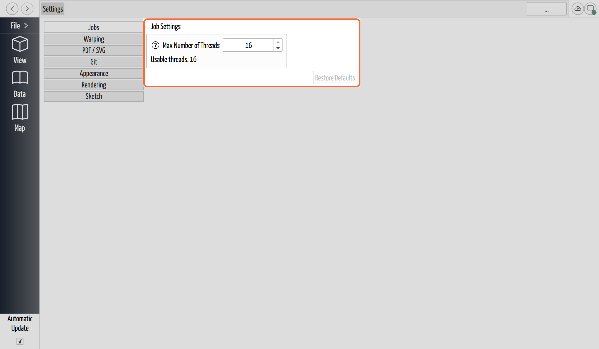
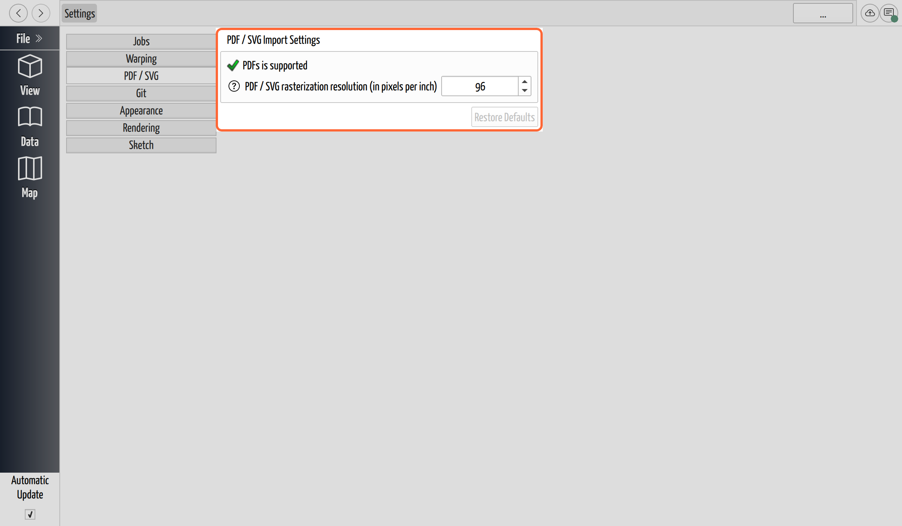
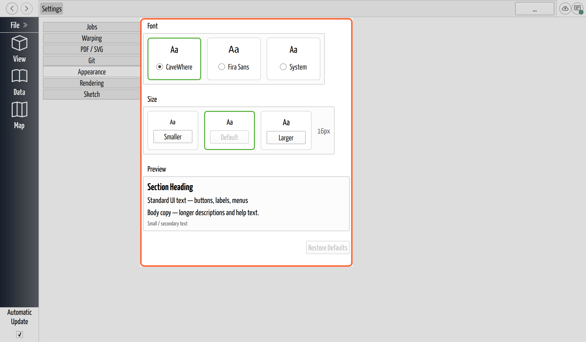
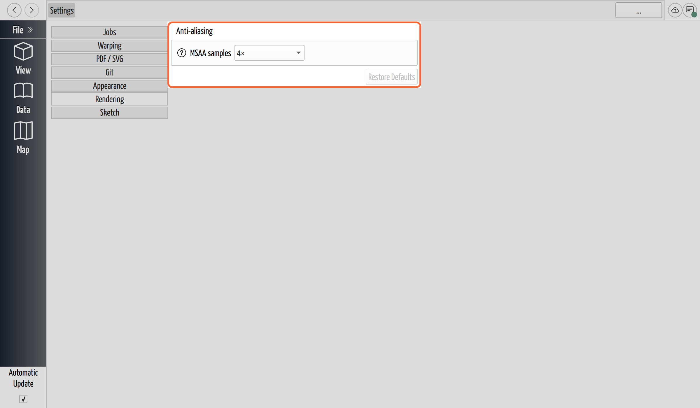

# Change CaveWhere's Settings

## Why / when you need this

CaveWhere's defaults suit most people on most machines, so Settings is somewhere
you go for a *specific* reason: the fans spin up while CaveWhere works, an
imported PDF looks soft when you zoom in, the interface text reads too small on a
high-resolution screen, or the 3D view's edges look jagged. Each of those is one
control away.

Know first what Settings is *not*. These preferences belong to CaveWhere **on
this computer**. Qt keeps them beside the app's other user settings, filed under
`Vadose Solutions` and `CaveWhere`, never inside a project. So they apply to
every cave you open here, they do not travel with a project you hand to someone
else, and changing one never edits your survey data.

## Open Settings

Open **File → Settings…**. The File menu lives in the macOS menu bar, and in the
File button at the top of the sidebar on Windows and Linux. Settings opens as a
page rather than a pop-up: 8 tabs run down the left, and the selected tab's
controls fill the right.

*Settings is a page, not a pop-up dialog. The tabs down the left switch between
groups of preferences.*

Three things hold across the tabs, and the shot above shows all 3:

- **No OK, Apply, or Cancel.** A change lands the moment you make it and saves
  itself. Close the page when you are finished.
- **Restore Defaults resets that tab**, and grays out once the tab already sits
  at its defaults, so the button doubles as a report of whether you changed
  anything. Git and Units have none; Sketch has one that never grays.
- **The small "?" buttons open help in place**, the same text summarized here.

Two tabs are covered elsewhere in this manual, because they belong to a task you
meet before you ever open Settings:

- **Git** holds your identity, the name and email that sign your saves. See
  [Set Up Your Identity](../getting-started/set-up-your-identity.md).
- **Warping** tunes how sketches morph onto the survey. See
  [Tune the Warping Settings](../scraps/warping-settings.md).

**Sketch** tunes thumbnail regeneration for the sketch prototype, so this page
leaves it alone.

## Cap the worker threads (Jobs)

CaveWhere recomputes carpets, solves the survey network and loads point clouds on
background threads. By default it uses every thread Qt reports your machine has,
which finishes that work as fast as the hardware allows. **Max Number of
Threads** caps it. The control runs from 1 up to the count printed below it as
**Usable threads**, and it cannot go higher than that. The tab's own help gives
the one reason to lower it:

> If your computer is experiencing over heating issues from CaveWhere, reducing
> the Max Number of Threads may help.

Nothing stops working when you lower it. CaveWhere still runs every job, just
fewer at a time, so each batch takes longer.

One wrinkle: the Jobs tab shares its storage with the sidebar's **Automatic
Update** checkbox, which decides whether recompute runs at all (see
[Scraps and Carpeting](../scraps/carpeting.md)). Uncheck Automatic Update and the
Jobs tab's Restore Defaults button lights up, though you never touched the thread
count. Press it and Automatic Update comes back on with it.

## Set the PDF and SVG import resolution (PDF / SVG)

A PDF or SVG note is not a photograph. It is a page description, which CaveWhere
turns into pixels when it draws the note, and this tab fixes how many pixels per
inch that takes. The field, **PDF / SVG rasterization resolution (in pixels per
inch)**, defaults to **96 ppi** and accepts 72 through 600. Too low and a finely
detailed drawing goes soft under the zoom you digitize at; too high and the note
eats memory for detail nobody can see.

For a 1-to-1 import that matches the source, use 72 ppi for a PDF or 92 ppi for
an SVG.

The **PDFs** line above the field reports whether this build can read PDFs at
all, as shown below. Every official download can; only a copy built from source
without Qt's PDF module reads **"PDFs is unsupported"**. SVG import needs no
such module. [Add Notes to a Trip](../notes/add-a-note.md) covers what this
number costs in memory and what changing it does to notes you already imported.

*The import resolution defaults to 96 ppi, with the PDFs line above it reporting
what this build can read.*

## Change the interface font and size (Appearance)

The **Appearance** tab sets the font CaveWhere draws its whole interface in,
which earns its keep on a high-resolution screen where the default text reads
small.

- **Font** offers 3 families, each drawn as an "Aa" sample: **CaveWhere** (the
  app's own display face, Yanone Kaffeesatz, and the default), **Fira Sans**, and
  **System**, your operating system's own interface font. Picking **System**
  restyles the interface only. Text CaveWhere renders outside it stays on Yanone
  Kaffeesatz, because macOS resolves the system font to `.AppleSystemUIFont`,
  which SVG viewers cannot draw.
- **Size** steps the base size by 2 px per press of **Smaller** or **Larger**,
  between 10 px and 28 px, with the current value printed beside the cards.
  CaveWhere starts at 16 px, Fira Sans and System at 14 px. The **Default** card
  wears an outline while you sit at the standard size.
- Switching family keeps your offset, not your number. Bump CaveWhere to 20 px, 4
  above its default, then pick Fira Sans and you land on 18 px.
- **Preview** draws a heading, UI text, body copy and small text at the current
  choice, so you can judge the change before leaving the tab; see below.

*Appearance changes the interface font for CaveWhere on this computer, with a
live preview of the result.*

## Smooth the 3D view's edges (Rendering)

Straight edges in the 3D view (survey lines, the borders of scraps) stair-step
unless the renderer smooths them. **MSAA samples** decides how
hard it works at that. **Off (1×)** turns smoothing off, and **2×**, **4×** and up
smooth more. The default is **4×**.

The list holds only the counts your graphics hardware reports, so the levels on
offer vary from machine to machine; see below. Metal supports 1, 2 and 4 samples
but not 8, so no Mac offers 8×, and a setting of 8× carried over from another
machine snaps quietly down to 4×. Each extra sample costs GPU time every frame,
and it bites hardest with a point cloud in view, because Eye-Dome Lighting
shading runs once per sample. The change applies at once, so switch to the 3D
view to judge it. I recommend leaving this at 4×
and dropping it only if a point cloud makes the view stutter.

*MSAA samples trades 3D-view smoothness against GPU cost.*

## Set the units new projects start in (Units)

The **Units** tab holds a single **Default** picker, and it ships set to metric.
It seeds new projects and nothing else. Every project stores its own unit system,
so changing this leaves the project you have open exactly as it was, along with
every project you already saved.

## Where to go next

- The Warping tab is covered with the scraps it affects:
  [Tune the Warping Settings](../scraps/warping-settings.md).
- The Git tab is where your name and email live:
  [Set Up Your Identity](../getting-started/set-up-your-identity.md).
- [The 3D View](../view-3d/the-3d-view.md) is the view the Rendering tab smooths.
