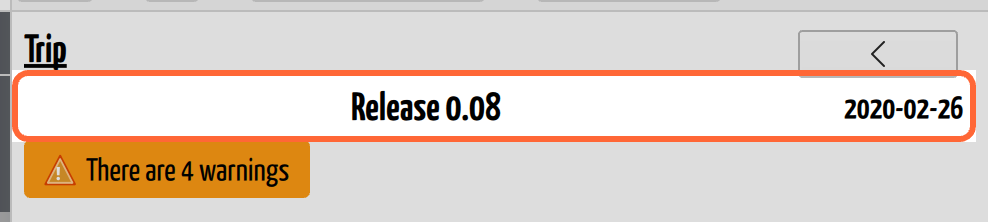
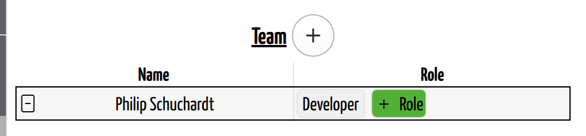

# Organize Caves and Trips

## Why / when you need this

A cave isn't surveyed in one go. It's surveyed by different people, on different
days, with different instruments, over years — and the map has to be assembled
from all of it.

CaveWhere's structure follows that reality:

**[Region](../concepts/glossary.md#region) → [Cave](../concepts/glossary.md#cave)
→ [Trip](../concepts/glossary.md#trip) → shots and notes**

The **trip** is the load-bearing one. A trip is *one team, one day, one set of
instruments* — and it is exactly the unit that shares a
[calibration](calibration.md) and a [declination](declination.md). That is why
those settings live on the trip and not on the cave or the shot: everything
measured on a given day needs the same correction, and a different day needs a
different one.

## Add a cave

Click **Data** in the sidebar to get the cave list, then **Add Cave**.

*The cave list. The bold name at the top is the **region** — the project's root,
which here happens to be named after its only cave. Each cave reports its length
and depth, and the triangle warns that something inside it needs attention.*

The cave list is also the project's dashboard: each cave shows how long and how
deep it is, and CaveWhere keeps those current as you enter data.

## Add a trip

Open a cave and click **Add Trip**. A new trip is dated **today** — which is
usually right if you're typing up tonight, and usually wrong if you're catching
up on a backlog, so check it.

*A cave page. **Add Trip** and **Import Survex** sit above the trip table.*

**Import Survex** sits beside it, and brings a trip in from an existing Survex
file rather than typing it. Import has its own chapter, still to be written.

The cave's trip table is the overview worth knowing:

| Column | Shows |
|--------|-------|
| **Name** | The trip's name |
| **Date** | When it was surveyed |
| **Stations** | The stations the trip used, as contiguous ranges — `A 1-14` |
| **Length** | Its surveyed length |
| **Decl** | Its [declination](declination.md), and whether that value is **auto** or **manual** |

That **Decl** column is a quick audit: a cave whose trips are mostly *auto* with
one stray *manual* is worth a second look, and vice versa.

## Name and date a trip

The trip's name and date sit at the top of the trip page, above the survey
table. **Double-click** either to edit.

*The trip's name and date. Neither responds to a single click — double-click the
one you want to change.*

- **Name** — anything you like, but it must be unique within the cave.
  CaveWhere silently keeps the old name if you try to reuse one, so if a rename
  appears not to have taken, that's why.
- **Date** — `yyyy-MM-dd`. It is not decoration: **auto declination is computed
  for the trip's date**, because declination drifts year on year. A trip dated
  wrongly by a decade gets a declination that's wrong by however much the field
  moved in that decade. Only the day is kept; time of day is discarded.

Naming is worth a moment's thought, because these names are what you'll navigate
by for years. Whatever your team recognizes — a date, a survey number, the
passage, the people — is better than `Trip 1`.

## Record the team

The **Team** section lists who was on the trip. Each member has a **Name** and
any number of **Role** chips.

*The Team section. The **+** beside the heading adds a member; the green
**+ Role** button adds another role to that member.*

**The names are not just documentation.** Every member's name automatically
becomes a **Caver** [keyword](../concepts/glossary.md#keyword) on the trip, and
keywords drive [layer visibility](../view-3d/the-3d-view.md#focus-on-part-of-the-cave-layers)
in the 3D view. So the team list is what lets you show only the passage a given
person surveyed — useful for checking one caver's work, for showing someone what
they found, or for tracking down whose trips a suspect pattern runs through. Type
a name here and it becomes something you can filter the whole cave by.

Spell names consistently, then. `Phil` and `Philip` are two different cavers as
far as the keyword is concerned, and the filter can only be as good as the list.

The names earn their keep on paper too: when a shot looks wrong five years on,
the fastest way to resolve it is to ask the person who took it, and the team
list is the only record of who that was. It's also how credit survives, which
matters more than software people tend to assume.

Roles are free text. Whatever your team calls the jobs — book, instruments,
sketch, tape, lead — is what to type. Unlike names, roles don't become keywords.

## Next steps

- [Enter Survey Data](enter-survey-data.md) — the shot table itself.
- [Calibrate the Instruments](calibration.md) — the per-trip corrections.
