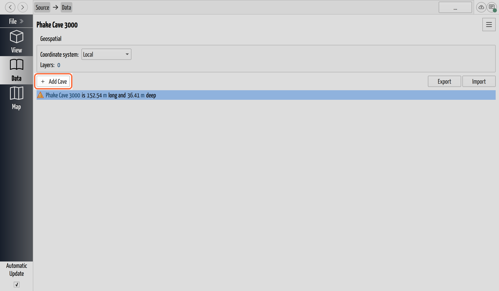
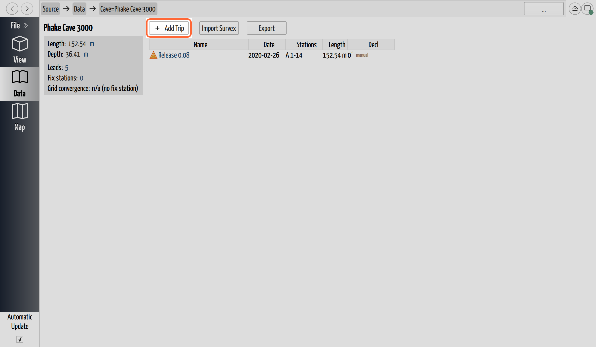
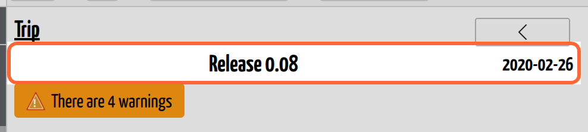
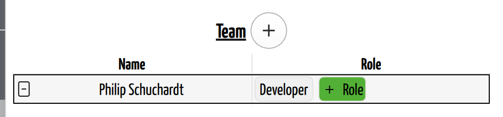

# Organize Caves and Trips

## Why / when you need this

A cave never gets surveyed in one go: different people, different days,
different instruments, sometimes decades apart, and the map has to come out of
all of it. The structure follows that:

**[Region](../concepts/glossary.md#region) → [Cave](../concepts/glossary.md#cave)
→ [Trip](../concepts/glossary.md#trip) → shots and notes**

The **trip** carries the weight: *one team, one day, one set of instruments*,
the unit that shares a [calibration](calibration.md) and a
[declination](declination.md), because everything measured on a given day needs
the same correction.

## Add a cave

Click **Data** in the sidebar for the cave list, then **Add Cave**. CaveWhere
names it from the count already in the project (`Cave 1`, `Cave 2`) and opens
its page so you can rename it.

*The cave list, with **Add Cave** highlighted.*

The list doubles as the project's dashboard: every solve writes each cave's
length and depth back into its row, and a triangle flags something inside that
wants attention.

### Remove a cave

Right-click a cave row, or long-press on a touchscreen, for a **Remove** item
naming the cave. A red box then asks **Remove Phake Cave 3000?**

Take that box seriously. Removing a cave takes every trip inside it, and every
note and scrap on those trips. The removal lands on an undo stack nothing in the
UI reaches: no Edit menu, no Ctrl+Z. Short of closing without saving or
[discarding back to your last save](../collaboration/review-history.md#discard-back-to-your-last-save),
that confirmation is all that stands between you and the delete.

## Add a trip

Open a cave and click **Add Trip**. Trips get counted names too (`Trip 1`,
`Trip 2`), and the new one lands dated **today**, right if you type up tonight,
wrong if you work through a backlog.

**I recommend fixing the date first.** Auto declination computes for whatever
date the trip carries, so a trip dated wrong by a decade picks up a declination
off by however far the field drifted.

*A cave page, with **Add Trip** highlighted over the trip table.*

**Import Survex** beside it pulls a trip from an existing `.svx` file. See
[importing Survex](../import-export/import-surveys.md#import-a-survex-file-as-a-new-trip).

The trip table runs 5 columns:

| Column | Shows |
|--------|-------|
| **Name** | The name, error icons in front |
| **Date** | `yyyy-MM-dd` |
| **Stations** | The **largest** run of consecutive stations, abbreviated: `A 1-14` |
| **Length** | Surveyed length, in the trip's units |
| **Decl** | Its [declination](declination.md), tagged **auto** or **manual** |

**Stations** reports only the largest run: a trip that also covers `B1`-`B3`
still shows `A 1-14`. Read the column as a label for the trip.

The **Decl** column makes for a fast audit: a cave whose trips run mostly *auto*
with one stray *manual* deserves a second look. Fix a batch in place with
shift-click or ctrl-click (cmd-click on macOS), then right-click and pick
**Declination → Auto**. A mixed selection leaves both **Auto** and **Manual**
unchecked. Removing a trip sits in that same menu, behind the same red
confirmation.

## Name and date a trip

The name and date sit at the top of the trip page, above the survey table.
**Double-click** either one to edit it.

*The name and date row, sitting above the survey table.*

A **name** must be unique within its cave, compared case-insensitively, so
`Sump Push` and `sump push` collide, but uniqueness stops at the cave: two caves
may each hold a `Trip 1`. The app also turns down an empty name, one padded with
spaces, a leading or trailing dot, and anything holding `\ / : * ? " < > |`.
Those rules exist because a `.cwproj` saves each trip as a directory: your text
is a folder name.

A rejected rename says nothing at all: the field snaps back to the old text, no
message appears. A rename that looks like it failed hit one of those rules. You
navigate by these names for years, so a date or a passage beats `Trip 1`.

A **date** takes `yyyy-MM-dd` and keeps the day only, discarding any time. It
does real work in 3 places: auto declination computes for it, and the trip
publishes `Date` and `Year` keywords that filter
[layers](../view-3d/the-3d-view.md#focus-on-part-of-the-cave-layers) in the 3D
view.

Type something the format cannot parse and the field does not push back: the
parse fails quietly and the trip loses its date. On a trip set to **auto**,
declination then falls back to the stored manual value and warns:

> Trip has no date; auto declination unavailable. Using stored manual value.

## Record the team

The **Team** section lists who came. The **+** beside the heading adds a blank
row; double-click the name cell to fill it in. The **−** and the green
**+ Role** button appear only on the selected row.

*The Team section, with its one row selected.*

**The names do more than document.** Every non-empty name becomes a **Caver**
[keyword](../concepts/glossary.md#keyword), and keywords drive
[layer visibility](../view-3d/the-3d-view.md#focus-on-part-of-the-cave-layers)
in the 3D view. So the team list is how you show only the passage a given person
surveyed. Spell names consistently: `Phil` and `Philip` are 2 different cavers
to the filter.

**+ Role** drops in a placeholder chip (`Role 1`, `Role 2`, and on up);
double-click it to type the real job. Clearing a chip's text deletes it, as does
selecting it and pressing Delete. Roles are free text and never become keywords.

## Next steps

- [Enter Survey Data](enter-survey-data.md) fills in the shot table.
- [Calibrate the Instruments](calibration.md) sets the per-trip corrections.
