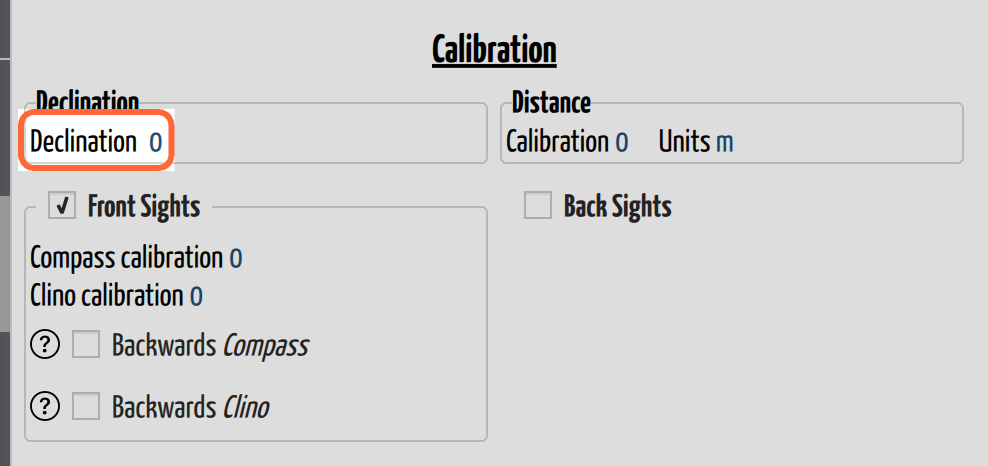

# Set the Declination

## Why / when you need this

Your compass does not point at north. It points at **magnetic north**, which is
somewhere else entirely — and where it is depends on where you're standing and
what year it is. The angle between the two is the **declination**, and it can be
tens of degrees.

Ignore it and nothing looks wrong. The cave plots, the loops close, the passages
have the right shapes and the right lengths. **The entire map is just rotated**,
by the declination, off true north. You find out when you try to lay it over a
surface map and the entrance is in the wrong field, or when the passage that
should run under the road doesn't.

It also has a way of showing up between trips. Declination drifts year on year,
so trips surveyed a decade apart carry different corrections. Get it wrong on
one of them and your loop closure errors turn up in the joins between trips,
where they are miserable to chase.

Declination lives in the **Declination** box of the trip's **Calibration**
section, and — like everything else there — it's per trip, which is what lets a
1998 trip and a 2026 trip in the same cave each get the right one.

*The Declination row in a cave that has no fixed station. There's no
**Auto**/**Manual** selector here — with no location to compute from, there's
nothing to choose between, so the value stands alone and is yours to type.*

## The rule: declination is added

CaveWhere states the arithmetic itself:

> CaveWhere calculates the true bearing (**TB**) by adding declination (**D**)
> to magnetic bearing (**MB**).
>
> **MB + D = TB**

So a positive (east) declination rotates your bearings clockwise. You enter what
the compass read; CaveWhere adds the declination and plots true.

## Let CaveWhere work it out (Auto)

Declination is not something you should be looking up by hand, and by default
you don't. In **Auto** mode CaveWhere computes it from the
**IGRF magnetic model** — the standard model of the Earth's magnetic field —
using two things it already knows:

- **the trip's date**, because declination drifts, and
- **the cave's location**, from its fixed station.

This is the right default. The model is more accurate than a value copied off a
website, it uses the date of *that* trip rather than today, and it costs you
nothing.

Auto needs both facts, so it needs the cave to have a **fixed station** — a
station whose real-world coordinates you have given. Without one, CaveWhere has
no idea where on Earth the cave is, and there is no declination to compute.
Until a cave is georeferenced, the mode selector isn't offered at all and the
value stays yours to enter.

## Enter it by hand (Manual)

Switch the dropdown to **Manual** and type the angle. You'll want this when:

- the cave has no fixed station,
- you're matching data that was reduced with a specific declination and want to
  reproduce it exactly, or
- your team corrected the declination **on the instrument** in the cave. In that
  case your book already holds true bearings, and the declination CaveWhere
  should apply is **0** — not the real declination, which would apply it twice.

In Auto the field is read-only and shows the computed value, so it's always
worth a glance even when you aren't editing it.

An imported survey that carried its own declination arrives in Manual, holding
the imported value. That's deliberate: a cave with a fixed station would
otherwise silently overwrite the number the original surveyors used.

## Warnings you might see

A warning icon appears beside the field when CaveWhere has something to say:

- **"Trip has no date; auto declination unavailable. Using stored manual
  value."** — Auto is on, but the trip's date is missing or unreadable, so
  there's no year to compute for. Set the [trip's date](caves-and-trips.md) and
  it resolves.
- **"Manual declination *x*° differs from computed *y*° by *z*°. Verify it's
  still correct."** — you are in Manual, but CaveWhere *could* have computed a
  value, and yours is at least half a degree away from it. This is a nudge, not
  an error. It's right to keep your value if you set it deliberately (see the
  corrected-on-the-instrument case above); it's worth a look if you don't know
  where the number came from.

## Next steps

- [Calibration](calibration.md) covers the rest of the box — tape, compass and
  clino corrections, which fix the *instrument* rather than the world.
- Auto declination depends on a fixed station. Georeferencing has its own
  chapter, still to be written.
