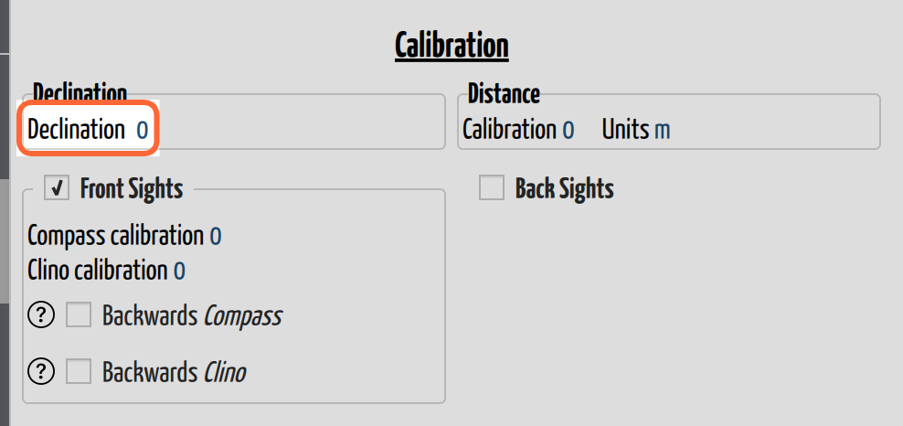

# Set the Declination

## Why / when you need this

Your compass does not point at north. It points at **magnetic north**, somewhere
else entirely, and where that lands depends on where you stand and what year you
stand there. The angle between the two, the **declination**, may reach tens of
degrees.

Ignore it and nothing looks wrong. The cave plots, the loops close, the passages
come out the right shape and the right length. **The entire map just sits
rotated** off true north by the declination. You find out when you lay it over a
surface map and the entrance lands in the wrong field, or when the passage that
should run under the road does not.

It also has a way of showing up between trips. Declination drifts year on year,
so trips surveyed a decade apart carry different corrections. Get one of them
wrong and your loop closure errors surface in the joins between trips, where
they are miserable to chase.

Declination lives in the **Declination** box of the trip's **Calibration**
section, and like everything else there it belongs to one trip, which is what
lets a 1998 trip and a 2026 trip in the same cave each carry the right value.

*The Declination row in a cave with no fixed station, shown above. No
**Auto**/**Manual** selector appears, because with no location to compute from
CaveWhere has nothing to choose between, so the value stands alone and you type
it.*

## The rule: declination is added

CaveWhere states the arithmetic itself:

> CaveWhere calculates the true bearing (**TB**) by adding declination (**D**)
> to magnetic bearing (**MB**).
>
> **MB + D = TB**

So a positive (east) declination rotates your bearings clockwise. You enter what
the compass read, and CaveWhere adds the declination and plots true.

> **Looking the value up?** The
> [NOAA magnetic field calculator](https://www.ngdc.noaa.gov/geomag/calculators/magcalc.shtml)
> already reports declination the way CaveWhere wants it, **east positive, west
> negative**, so **enter what it gives you as-is, sign and all.** A west
> declination of `-3.2°` goes in as `-3.2`; keep the minus and do not flip it.
> Set the calculator's date to the date of the *trip*, since declination drifts.

## Let CaveWhere work it out (Auto)

Looking declination up by hand wastes your time, and by default you never do. In
**Auto** mode CaveWhere computes it from **IGRF-14**, the standard model of the
Earth's magnetic field, which ships inside Survex as
`survex/src/igrf14coeffs.txt`. It needs 2 things it already knows:

- **the trip's date**, because declination drifts, and
- **the cave's location**, from its fixed station.

I recommend leaving Auto on. It uses the date of *that* trip, it costs you
nothing, and it removes 3 ways to get the number wrong: looking it up, mistyping
it, and forgetting to update it.

Auto needs both facts, so the cave needs a **fixed station**, one whose
real-world coordinates you have given. Without it CaveWhere cannot know where on
Earth the cave sits, so no declination exists to compute. Until you georeference
a cave, CaveWhere offers no mode selector at all and the value stays yours to
enter.

## Enter it by hand (Manual)

Switch the dropdown to **Manual** and type the angle. You want this when:

- the cave has no fixed station,
- you match data reduced with a specific declination and need to reproduce it
  exactly, or
- your team corrected the declination **on the instrument** in the cave. Your
  book then already holds true bearings, so the declination CaveWhere should
  apply becomes **0**. Enter the real declination and you apply it twice.

In Auto the field turns read-only and displays the computed value, so it repays
a glance even when you do not edit it.

An imported survey carrying its own declination arrives in Manual, holding the
imported value. That happens deliberately: a cave with a fixed station would
otherwise silently overwrite the number the original surveyors used.

## Warnings you might see

A warning icon appears beside the field when CaveWhere has something to say:

- **"Trip has no date; auto declination unavailable. Using stored manual
  value."** Auto is on, but the trip's date is missing or unreadable, so no year
  exists to compute for. Set the [trip's date](caves-and-trips.md) and it
  resolves.
- **"Manual declination *x*° differs from computed *y*° by *z*°. Verify it's
  still correct."** You sit in Manual, CaveWhere *could* have computed a value,
  and yours differs by at least **0.5°**. Treat it as a nudge, not an error.
  Keep your value if you set it deliberately, as in the corrected-on-the-
  instrument case above. Go and look if you do not know where the number came
  from.

## Next steps

- [Calibration](calibration.md) covers the rest of the box: distance, compass
  and clino corrections, which fix the *instrument* instead of the world.
- [Georeference a Cave](../georeferencing/georeference-a-cave.md): fix a station
  so Auto declination has a location to compute from.
