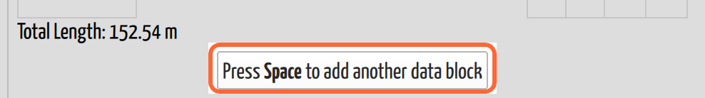

# Enter Survey Data

## Why / when you need this

*The trip page. The **survey editor** is the highlighted panel on the left, and
the scanned survey book sits beside it — the readings in the book are what you
type into the editor. The banner near the top reports this trip's
[warnings](survey-errors.md).*

Paper surveyors spend most of their CaveWhere time on this one screen. A trip
brings back a book full of numbers, and none of them do anything until they are
typed in. Everything else in this manual — the 3D model, the
[carpets](../concepts/glossary.md#carpeting), loop closure — is built on top of
what you enter here.

The screenshot above is the job in one picture: the book on the right, the table
on the left, and you moving numbers from one to the other.

So the survey table is built for **speed and for catching mistakes**. You can
enter a whole trip without touching the mouse, and CaveWhere checks each reading
as you type it rather than waiting until you try to plot the cave. A transposed
digit found now is a minute's work; found six months later, it's a return trip.

## Open the survey table

Click **Data** in the sidebar, click the cave, then click the trip. The survey
table fills the left side of the trip page, under the trip's name and date.

The chevron beside the **Trip** heading folds the table away to a narrow strip,
with the trip's name turned on its side. That hands the width to the note
gallery, which is what you want once the data is in and you're working on the
sketches. The chevron on the strip brings it back.

## Read the table

This is the part that surprises people, and it is worth understanding before you
type anything: **the table does not have one row per shot.** Station rows and
shot rows alternate.

*The survey table. Station rows carry the name and the LRUDs; the shot rows
between them carry Distance, Compass and Vertical Angle. This trip records
foresights only, so every reading is tagged `fs`. The second block starts again
at `a4`, a station the first block already passed through — a branch, which is
exactly what a block can't contain.*

| Row | Holds |
|-----|-------|
| **Station** row | The station name, and its **L**, **R**, **U**, **D** |
| **Shot** row | The **Distance**, **Compass**, and **Vertical Angle** between the station above it and the station below it |

The shot row is drawn straddling the boundary between the two station rows it
connects, and it is deliberately offset so you can see which two stations it
joins.

The layout mirrors your survey book, because it mirrors the cave: a
[shot](../concepts/glossary.md#shot) is a measurement *between* two stations,
while [LRUD](../concepts/glossary.md#lrud) is a measurement *at* one station. A
single flat row per shot would have to pick one station's LRUD to carry, and
would get the other one wrong.

The columns are:

- **Station** — the station's name, e.g. `A1`. Letters, numbers, hyphens and
  underscores.
- **Distance** — the tape reading, in the trip's units (see
  [Calibration](calibration.md#set-the-tape-units)).
- **Compass** — the bearing, always in degrees, `0`–`360`.
- **Vertical Angle** — the inclination, `-90` to `90` degrees. This is the one
  column whose name won't match your book, which almost certainly says *clino*.
  CaveWhere's own error messages call it the clino too, and so does the rest of
  this manual.
- **L**, **R**, **U**, **D** — left, right, up and down from the station to the
  walls, ceiling and floor.

If the trip records both foresights and backsights, the Compass and Vertical
Angle cells split in half, with the foresight (`fs`) above the backsight (`bs`).
Which of those you see is set per trip in [Calibration](calibration.md).

## Add shots

**Just start typing.** There is no "new row" button in the normal flow. The
table always keeps one empty station-and-shot pair at the end, and the moment
you put data into it, CaveWhere appends a fresh empty pair below. Enter a trip
top to bottom and rows keep appearing ahead of you.

The reverse also happens: empty trailing rows are trimmed away when you move to
another block, so an accidental Tab through the end of the table doesn't leave
debris in your data.

A brand-new trip starts with an **Add Survey Data** button — that only appears
when the trip has no data at all, and it seeds the first block. After that, the
table grows by itself.

### Let CaveWhere name the next station

When you land on an empty station at the end of a run, CaveWhere guesses the
next name from the previous one (`A1` → `A2`) and shows it greyed out with a
**Press Tab** hint. Tab accepts the guess. If the guess is wrong, type over it.

This is worth using: station names are the one field where a typo doesn't look
like a typo. `A12` and `A l2` both read fine at a glance, but only one of them
connects to your survey.

### Station names ignore case

`a1` and `A1` are **the same station** to CaveWhere. You can enter a chunk in
lowercase and tie it to stations written uppercase elsewhere, and they will
connect.

Two things follow. Case is never the reason two stations fail to join — look for
a real difference in the characters. And you cannot use `a1` and `A1` as two
distinct stations; they will silently become one.

(This is CaveWhere-wide: scraps and [LiDAR notes](../notes/lidar-notes.md) match
station names the same way. Compass is the exception — it *is* case-sensitive,
so CaveWhere writes station names out in uppercase when exporting to it.)

## Start a new data block

A block — CaveWhere calls it a **chunk** — is a *continuous* run of stations
joined by shots. That is the whole rule, and it explains the button:

**A chunk cannot branch.** It is a line, not a tree. So when you walk back to
`A3` and head off down a side passage, those shots cannot continue the block you
were in — the block would have to fork at `A3`, and it can't. They start a new
block instead.

Press **Space** in any cell to add one, or click the
**Press Space to add another data block** bar under the table. A trip holds as
many blocks as it needs, and CaveWhere will not create a duplicate empty one if
an unused block is already sitting at the end.

*The bar at the foot of the editor, below every data block. It does the same
thing the **Space** key does — and says so, because the key is the faster way
once your hands are on the keyboard.*

Blocks are also why an imported survey arrives split into several sections: the
importer starts a new block every time a shot won't attach to the end of the
current one.

## Move around with the keyboard

Data entry is a two-handed job with a book in front of you, so the table is
built to be driven entirely from the keyboard.

| Key | Does |
|-----|------|
| **Tab** / **Shift+Tab** | Next / previous cell |
| **Arrow keys** | Move a cell in any direction |
| **Enter** | Start editing; while editing, commit and move on |
| **Space** | Add a new data block |
| **Esc** | Abandon the edit and put the old value back |
| Any valid character | Starts editing that cell immediately |

That last one is the one that makes entry fast: you do not have to "open" a cell
first. Land on it, type the number, Tab. Cells that aren't shown — the backsight
halves on a foresight-only trip — are skipped automatically.

## Enter a plumbed shot

For a vertical shot, type **up** or **down** into the Vertical Angle instead of
a number. CaveWhere accepts either word, in any case.

A plumb is exempt from the checks that would otherwise complain about the
reading, and CaveWhere treats an exact `90` or `-90` as a plumb too. What you
cannot do is mix the two conventions across a foresight and backsight of the
same shot: both must be words, or both must be numbers. (See
[Survey Errors](survey-errors.md#you-are-mixing-types).)

## Insert and remove rows

Right-click any cell for its menu.

On a **station** cell you can insert a **Station above** or **Station below**,
or remove the station — and because a block must keep its stations and shots
paired, removing a station always takes a shot with it. That's why the remove
item is a submenu asking *which*: **and the shot above** or **and the shot
below**. Shot cells offer the mirror image.

Hover a remove item before clicking and CaveWhere strikes a line through exactly
the rows that would go. Use it — it is easier to read the preview than to reason
about which shot pairs with which station.

Both menus also offer **Remove Chunk**, which deletes the whole block.

A block can never shrink below two stations and one shot, so the remove items
grey out at that point. To get rid of the last of it, remove the chunk.

## Exclude a distance from the total

The caret menu on a Distance cell offers **Exclude Distance**, and an excluded
shot shows an **Excluded** badge.

This does **not** remove the shot from the cave. The leg still positions the
stations exactly as before — it is dropped from the cave's **total length**
only.

That is what you want when you re-survey passage that has already been surveyed:
tying two surveys together, or resurveying a section to better standards. The
shot has to be there to hold the stations in the right place, but the passage it
covers is already counted, and counting it twice would inflate the length of the
cave.

The trip's own length is shown under the table as **Total Length**, in the
trip's units.

## Fill in LRUD

LRUD goes on the station rows. It is optional as far as plotting goes — the
survey line is made of shots — but without it the passage has no width or
height, so nothing downstream can give it shape.

A shot with an **explicitly entered zero** distance and no compass or clino is
treated specially: it's an **LRUD-only** station, one where you recorded the
passage dimensions without measuring a leg. Leaving the distance **empty** is
not the same thing — that's an unfinished shot, and CaveWhere flags it as an
error.

## Next steps

- Instruments don't read true. [Calibration](calibration.md) corrects them.
- A compass points at magnetic north. [Declination](declination.md) turns that
  into true north.
- CaveWhere marks up mistakes as you type — see
  [Survey Errors](survey-errors.md).
