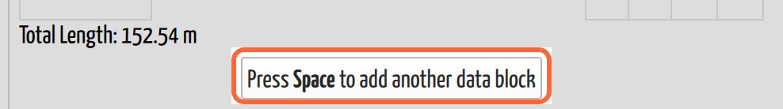
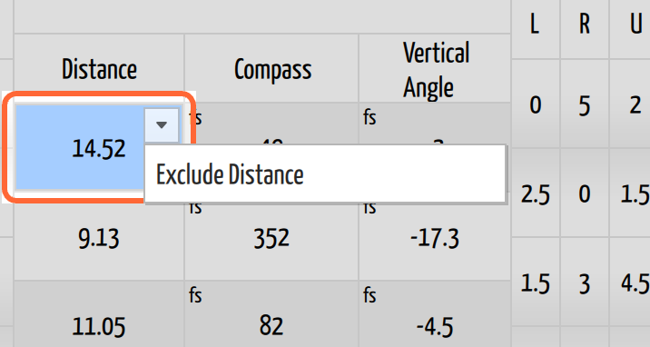

# Enter Survey Data

## Why / when you need this

*The trip page, shown above. The **survey editor** fills the highlighted panel
on the left, and the scanned survey book sits beside it. You type the readings in that book into the editor. The banner near
the top reports this trip's [warnings](survey-errors.md).*

Paper surveyors spend most of their CaveWhere time on this one screen. A trip
brings back a book full of numbers, and none of them do anything until you type
them in. Everything else in this manual (the 3D model, the
[carpets](../concepts/glossary.md#carpeting), loop closure) builds on what you
enter here.

The screenshot above shows the job in one picture: the book on the right, the
table on the left, and you moving numbers from one to the other.

So the survey table chases 2 things: **speed, and catching mistakes**. You can
enter a whole trip without touching the mouse, and CaveWhere checks each reading
as you type it rather than waiting until you try to plot the cave. A transposed
digit found now costs a minute. Found once you are home, it costs a return trip.

## Open the survey table

Click **Data** in the sidebar, click the cave, then click the trip. The survey
table fills the left side of the trip page, under the trip's name and date. In a
wide window it measures 500 px across.

The chevron beside the **Trip** heading folds the table away to a narrow strip,
with the trip's name turned on its side. That hands the width to the note
gallery, which is what you want once the data is in and you are working on the
sketches. The chevron on the strip brings it back. Narrow the trip page below 600
px (`Theme.qml` calls that breakpoint `breakpointPanelCollapse`) and the chevron
disappears, since the editor then fills the page and has nothing to hand the
width to.

## Read the table

This part surprises people, and it repays understanding before you type
anything: **the table does not have one row per shot.** Station rows and shot
rows alternate, as the screenshot below shows.

*The survey table, showing 3 data blocks. Station rows carry the name and the
LRUDs; the shot rows between them carry Distance, Compass and Vertical Angle.
The Compass and Vertical Angle readings are tagged `fs` for foresight, and this
trip has no backsights, so no `bs` row sits under them. The second
block starts again at `a4`, a station the first block already passed through: a
branch, which is exactly what a block cannot contain.*

| Row | Holds |
|-----|-------|
| **Station** row | The station name, and its **L**, **R**, **U**, **D** |
| **Shot** row | The **Distance**, **Compass**, and **Vertical Angle** between the station above it and the station below it |

Look at the offset in the screenshot above. A station row's cells stand 50 px
tall. The shot row itself has a height of 0, and CaveWhere draws its cells 25 px
higher, half a row, so they straddle the boundary between the 2 stations they
join. That tells you at a glance which pair a shot belongs to.

The layout mirrors your survey book, because it mirrors the cave. A
[shot](../concepts/glossary.md#shot) measures *between* 2 stations, while
[LRUD](../concepts/glossary.md#lrud) measures *at* one of them. A single flat row
per shot would have to pick one station's LRUD to carry, and get the other one
wrong.

The 8 columns, left to right:

- **Station** holds the station's name, `A1` say. Letters, digits, hyphens and
  underscores; `cwStationValidator.cpp` pins the set to the regex
  `(?:[a-zA-Z0-9]|-|_)+`, so the cell rejects a dot or a space as you type it.
- **Distance** takes any number at or above `0`, in the trip's units (see
  [Calibration](calibration.md#set-the-distance-units)).
- **Compass** takes the bearing, always in degrees, `0` to `360`.
- **Vertical Angle** takes the inclination, `-90` to `90` degrees. This one
  column will not match your book, which almost certainly says *clino*.
  CaveWhere's own error messages call it the clino too, and so does the rest of
  this manual.
- **L**, **R**, **U**, **D** take left, right, up and down from the station to
  the walls, ceiling and floor.

If the trip records both foresights and backsights, the Compass and Vertical
Angle cells each split into 2 rows of roughly 25 px, foresight (`fs`) above backsight
(`bs`). [Calibration](calibration.md) decides which of those you see, per trip.

## Add shots

**Just start typing.** No "new row" button appears in the normal flow. The block
you are working in carries a spare station-and-shot pair below its last filled
row. Put data into that pair and CaveWhere makes it real, then hangs a fresh
spare below it. Enter a trip top to bottom and rows keep appearing ahead of you.

Only the block you are in shows that spare pair; `cwSurveyEditorModel` calls
them virtual rows and hands them to the focused chunk alone. Move to another
block and the spare goes away, taking every other empty station-and-shot pair
with it, so an accidental Tab off the end leaves no debris.

A brand-new trip starts with an **Add Survey Data** button, which appears only
while the trip holds no data at all and seeds the first block. After that the
table grows by itself.

### Let CaveWhere name the next station

Land on an empty station at the end of a run and CaveWhere guesses the next name
from the previous one (`A1` → `A2`), shown under a grayed **Press Tab**
hint. Tab accepts the guess, and so does clicking the hint. Sometimes the guess
is wrong; type over it.

The guess comes from a small regex in `cwSurveyChunk.cpp`: find the first run of
digits in the previous name and add 1. `A9` gives `A10`, `B12` gives `B13`. It
fails on 3 shapes of name, and all 3 are worth knowing:

- A name holding no digits gets nothing to increment, so `entrance` gets no
  guess at all.
- A leading zero vanishes, unfortunately. `A01` guesses `A2`, not `A02`.
- Anything after the number vanishes with it. `A1B` guesses `A2`.

In a brand-new block the guess reaches back to the last station of the block
above it, so walking off from `A5` into a new block offers you `A6`.

Use the guess. Station names are the one field where a typo does not look like a
typo. `A10` and `A1O` both read fine at a glance, and only one of them connects
to your survey.

### Station names ignore case

`a1` and `A1` name **the same station**. `cwStation::canonicalKey()` lowercases
every name before the pipeline compares it, so you can enter a block in
lowercase and tie it to stations written uppercase elsewhere, and they will
connect.

That has 2 consequences. Case never explains 2 stations failing to join, so look
for a real difference in the characters. And you cannot use `a1` and `A1` as 2
distinct stations; they will silently become one.

(This holds CaveWhere-wide: scraps and [LiDAR notes](../notes/lidar-notes.md)
match station names the same way. Compass is the exception, since it *is*
case-sensitive, so CaveWhere writes station names out in uppercase when
exporting to it.)

## Start a new data block

A block, which CaveWhere calls a **chunk**, holds a *continuous* run of stations
joined by shots. That is the whole rule, and it explains the button.

**A chunk cannot branch.** It forms a line, not a tree. So when you walk back to
`A3` and head off down a side passage, those shots cannot continue the block you
were in: the block would have to fork at `A3`, and it cannot. They start a new
block instead. The second block in the table screenshot above restarts
at `a4` for exactly that reason.

Press **Space** in any cell to add one, or click the
**Press Space to add another data block** bar under the table, shown below. A
trip may hold as many blocks as it needs. CaveWhere will not create a second
empty block while an unused one already sits at the end; it moves your focus to
that one instead.

Space means *new data block*, even mid-edit: `DataBox.qml` commits the cell
first, then adds the block, and a cell holding an invalid value stops it there
with no block added. No cell in this table would take a space anyway, so nothing
is lost.

*The bar at the foot of the editor, below every data block. It does the same
thing the **Space** key does, and says so, because the key is the faster way
once your hands are on the keyboard.*

Blocks also explain why an imported survey arrives split into several sections.
Every importer runs the same test, `canAddShot`: does this shot's from-station
match the name of the last station in the current block? `cwSurvexImporter` and
the CSV importer call it directly, and `cwTrip::addShotToLastChunk` does it for
the rest. On a mismatch the importer opens a new block and carries on there.

## Move around with the keyboard

Data entry is a two-handed job with a book in front of you, so the table drives
entirely from the keyboard.

| Key | Does |
|-----|------|
| **Tab** / **Shift+Tab** | Next / previous cell |
| **Arrow keys** | Move a cell in any direction |
| **Enter** | Start editing; while editing, commit and move on |
| **Space** | Add a new data block |
| **Esc** | Abandon the edit and put the old value back |
| Any valid character | Starts editing that cell immediately |

That last row is what makes entry fast: you never have to "open" a cell first.
Land on it, type the number, Tab. Cells the trip does not use, the backsight
halves on a foresight-only trip, get skipped automatically.

Tab does not run straight across the table. It walks a block roughly the way the
book gives it to you: both station names of the first pair, then the shot
readings between them, then the LRUDs. Then the next station name, the next
shot, and on down. The one drawback: the first pair breaks the pattern, since
Tab visits both station names before it visits any reading. The arrow keys give
you the plain grid instead, and they stop at the edges. Left on the Station
column and Right on **D** go nowhere.

**I recommend letting Tab do the walking.** It lands on every cell that matters
without you steering, and it is the route that skips the hidden backsight cells
for you.

An invalid value pins you in place. Tab runs the cell's validator before it
moves, and a rejected value pops the validator's complaint under the cell and
leaves the focus where it was.

## Enter a plumbed shot

For a vertical shot, type **up** or **down** into the Vertical Angle instead of
a number. `cwClinoValidator.cpp` matches either word case-insensitively, so
`up`, `Up` and `UP` all land.

A plumbed shot needs no compass, and CaveWhere knows it. The word form stops the
missing-compass and missing-clino errors, and it skips the 2°
foresight/backsight tolerance too, since `up` carries no number to compare. A
numeric `90` or `-90` also counts as a plumb for the missing-reading check, with
0.001° of slop allowed on the value, but it still gets compared against its
backsight.

What you cannot do is mix the 2 conventions across a foresight and backsight of
the same shot: both must be words, or both must be numbers. (See
[Survey Errors](survey-errors.md#you-are-mixing-types).)

## Insert and remove rows

Right-click any cell for its menu. The station name and the 4 LRUDs share one
menu; Distance, Compass and Vertical Angle share the other.

On a **station** cell an **Insert** submenu offers **Station above** and
**Station below**, and you can remove the station. Because a block keeps its stations and shots paired,
removing a station always takes a shot with it. So the remove item opens a
submenu named for the station (**Remove A3**) that asks *which*: **and the shot
above** or **and the shot below**. The shot menu mirrors it, with **Remove
shot** over **and A3** / **and A4**, naming the station each choice would take.

Hover a remove item before clicking and CaveWhere strikes a line through exactly
the rows that would go. Read the preview; it beats reasoning about which shot
pairs with which station.

Both menus also offer **Remove Chunk**, which deletes the whole block. No dialog
asks you to confirm, so that strike-through is the only warning you get.

A block can never shrink below 2 stations and the single shot between them, so
`canRemoveStation` refuses there and the remove items gray out. To clear the
last of it, remove the chunk.

## Exclude a distance from the total

Select a Distance cell and a 20 px caret button appears in its top-right corner,
as shown below. It exists only while that cell holds the focus, so it will not
be waiting on a cell you have not clicked into. Its menu holds a single item:
**Exclude Distance** on a shot that counts toward the total, **Include
Distance** on one that does not. The same item both ways, so it also puts a
length back. An excluded shot wears an **Excluded** badge in its Distance cell.

*The caret button and its menu, shown above, on the first shot's Distance cell,
which reads 14.52. Note the ring: the button appeared because that cell holds
the focus.*

Excluding does **not** remove the shot from the cave. The leg still positions
the stations exactly as before. `cwTripLengthTask` drops it from the sum, and
also from the shot count that the tape calibration multiplies, so an excluded
shot contributes nothing to the length either way.

You want that when you re-survey passage someone already surveyed: tying 2
surveys together, or redoing a section to better standards. The shot has to be
there to hold the stations in place, but the passage it covers is already in the
total, and counting it twice inflates the cave.

**Total Length** under the table reports the trip's own length, to 2 decimal
places, in the trip's units.

## Fill in LRUD

LRUD goes on the station rows. Plotting does not need it, since shots alone make
the survey line, but without it the passage has no width or height, so nothing
downstream can give it shape.

CaveWhere asks for all 4. Once a station has a name, each empty LRUD beside it
raises its own warning, so a station you skipped entirely carries 4 of them. Fill
LRUDs in as you go down the block rather than sweeping back for them; at 4
warnings a station, they bury the one warning that actually matters.

A shot with an **explicitly entered zero** distance and no compass or clino gets
treated specially: an **LRUD-only** station, one where you recorded the passage
dimensions without measuring a leg. Compass sometimes writes these, hanging
dimensions on a station that has no leg of its own. Leaving the distance
**empty** means something else entirely. That is an unfinished shot, and
CaveWhere marks it fatal.

## Next steps

- Instruments do not read true. [Calibration](calibration.md) corrects them.
- A compass points at magnetic north. [Declination](declination.md) turns that
  into true north.
- CaveWhere marks up mistakes as you type. See
  [Survey Errors](survey-errors.md).
