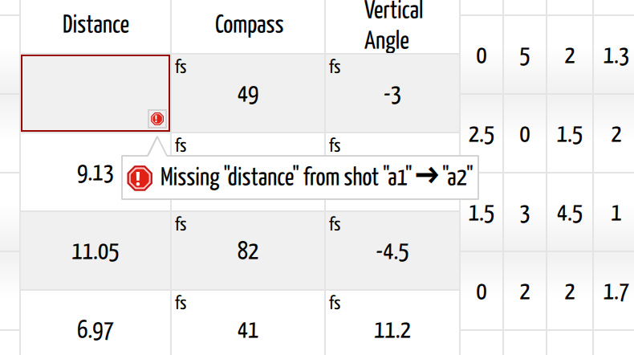

# Fix Survey Errors

## Why / when you need this

Tired people enter survey data from a muddy book, and some of it comes out
wrong. The useful question asks not whether you made a mistake, but whether you
catch it now or after the map is drawn.

So CaveWhere checks every reading as you type it and marks the cell, instead of
waiting for you to plot the cave. The cell gets a border and a **small square
badge** in its corner, carrying a stop sign for an error or a triangle for a
warning. Click the badge to read the message. Clicking another one closes the
first, so you read them one at a time, as shown below.

*A shot whose distance never got entered. The message names the missing reading
and the shot it belongs to, so you know which line of the book to go back to.*

## Errors versus warnings

The distinction stays exact, and it tells you how urgently to care:

| | Meaning |
|---|---|
| **Error** (fatal) | The cave **cannot be plotted** until you fix it. CaveWhere cannot guess what you meant. |
| **Warning** | The cave plots fine. This looks wrong and deserves a look, but you may disagree. |

The trip's header carries a running total, **"There are *n* errors"** behind a
stop sign and **"There are *n* warnings"** behind a warning triangle. It
disappears once the trip comes up clean, which makes it the fastest way to tell
whether a trip is finished.

**The counts roll all the way up.** A bad cell marks its trip, and the trip
marks its cave, so the same stop sign and triangle turn up beside the trip in
the cave's trip table and beside the cave in the cave list. You never have to
open a trip to learn whether it needs attention, and a project you last touched
a year ago tells you where you left off.

You can **suppress** a warning once you have checked it and satisfied yourself:
the popup puts a checkbox beside each one, and ticking it strikes the message
through. Errors carry no such checkbox, because nothing plots until the data
says something.

## Errors

### Missing station name

A shot next to this station has data, but the station has no name. A shot runs
*from* somewhere *to* somewhere, and a nameless end connects to nothing.

Type the name. A blank name on a row you have not touched counts as **no** error
at all; CaveWhere only asks once data appears beside it.

### Duplicate station name "*x*"

This station carries the same name as **the station immediately above it**, so
the shot between them starts and ends in the same place.

CaveWhere checks only the adjacent pair, deliberately. **A station name
repeating elsewhere is the point of the whole exercise.** Coming back to `A3`
from a different direction is how a loop closes, and how CaveWhere learns that
two runs of passage meet. A shot from `A3` to `A3` carries no such meaning.

Usually a slip causes it: you meant to type the next name and repeated the last.
Remember that names ignore case, so `a3` under `A3` duplicates too.

### Missing "*x*" from shot "*A1*" ➔ "*A2*"

A reading the shot needs sits empty. **Distance is always fatal**, because a leg
with no length cannot plot at all.

Compass and clino depend on what else you have. Fill in the matching backsight
(or foresight) and this drops to a *warning*, because CaveWhere can plot from
the one reading. Leave both empty and the shot has no direction, which makes it
fatal.

### The "*x*" value ("*y*") isn't a number for station "*z*"

An LRUD cell holds something other than a number. Clear it or fix it.

### You are mixing types

> You are mixing types. Frontsight and backsight must both be Up or Down, or
> both numbers

You wrote a word in one half of a shot's Vertical Angle and a number in the
other, `up` against `89`, say. Pick one convention for the shot: plumb both
readings (`up`/`down`), or give both as angles.

### Invalid readings

Type something a cell cannot accept and you get the cell's own message:

- **Distance** takes a number **≥ 0**.
- **Compass** takes a number **between 0 and 360**.
- **Vertical Angle** takes a number **between −90 and 90**, or the keywords
  **up** or **down**.
- **Station names** take letters and numbers, plus hyphens and underscores.

### Survey leg isn't connected to the cave

The plot could not run, because a block of shots fails to reach the rest of the
cave:

> Cannot solve: *n* survey leg(s) are not connected to the cave network
> (*cave*). Open the affected chunks and fix the disconnected station names.

Every block has to join the network *somewhere*, through a station name it
shares with another block. A block sharing none floats free, and CaveWhere
cannot know where in the cave it belongs, so it refuses to plot rather than drop
it somewhere arbitrary.

A name that does not match what you think it matches nearly always causes this.
Check the first station of the orphaned block against the station it should tie
to, character by character. `O` against `0` and `l` against `1` make the classic
pair. Case never causes it, because CaveWhere ignores case.

## Warnings

### Frontsight and backsight differs by *x*°

**This warning earns its keep.** The foresight and backsight of this shot
disagree by more than **2°** once CaveWhere reverses the backsight and applies
[calibration](calibration.md). That 2° default lives in `cwSurveyChunk.h`.

Two readings of the same leg should agree. When they disagree, one of them is
wrong, and the shot tells you so on the day instead of at
[loop closure](../loop-closure/check-loop-closure.md) six months later. Common
causes, in rough order:

- A **transposed digit**, `173` typed as `137`.
- **Iron** near one end of the shot: a bolt, a carbide dump, a helmet on the
  floor beside the instrument.
- The wrong **corrected/backwards** box ticked in
  [Calibration](calibration.md#tell-cavewhere-which-way-a-reading-was-shot),
  though that misfires on every shot at once instead of one.

Readings that disagree by *about 180°* point at a convention problem instead of
a reading problem; see Calibration.

CaveWhere never tolerance-checks plumbed shots (`up`/`down`), because they carry
no angle to compare.

### Missing "*x*" for station "*y*"

An LRUD sits empty. Only a warning, since the survey line does not need it, but
the passage gets no width or height there, so anything drawing passage shape has
nothing to work with.

## A warning is not always wrong

Warnings are judgment calls, and CaveWhere lets you overrule them. A 3°
foresight/backsight split beside a large iron deposit may be the best reading
that cave will ever give up. Check it, satisfy yourself, and suppress it.

Leaving warnings lying around unread is the thing to avoid. The check earns its
value by making an unexpected warning stand out, and it cannot stand out with
forty others already on the trip. I clear a trip's warnings before I leave it,
even the ones I intend to suppress.
