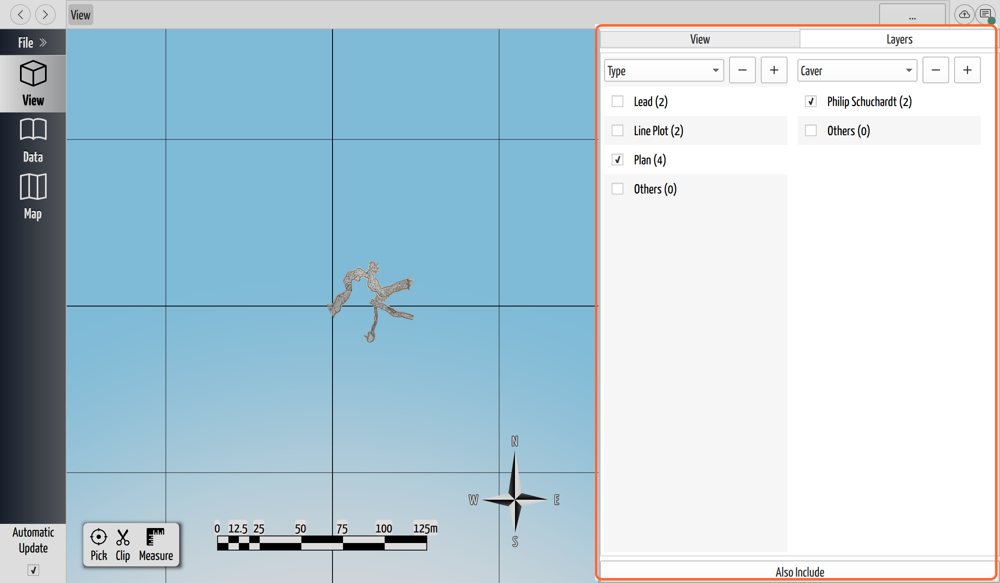

# Focus the View with Keyword Layers

## Why / when you need this

The 3D view draws everything at once: every cave, every trip's survey line, every
carpeted scrap, every lead marker, every point cloud. On a small cave that is
what you want. On a real project, several caves and years of trips, it is far too
much to see through, let alone work in. When you're checking one team's passage,
planning against just the leads, or lining the survey up against a point cloud,
everything else sits in the way.

Keyword layers cut the scene down. They work like layers in a drawing program,
except you never manage a list of layers by hand. Instead you filter on the
**[keywords](../concepts/glossary.md#keyword)** CaveWhere already attached to
everything it draws. That lets you carve the scene along whatever line matters
right now: by cave, by trip, by who surveyed it, by object type, or by several of
those at once.

## What a keyword is (and where it comes from)

A keyword is a `key = value` tag, like `Type = Plan` or `Caver = Alice`. You never
type one. CaveWhere generates them from your survey data as it builds the model,
and every object inherits the tags of everything it hangs under. A single plan
scrap carries its own `Type = Plan` plus the `Cave`, `Trip`, `Year`, `Date`, and
`Caver` tags of the trip and cave above it, so the *same* scrap answers to any of
them. (This is the "keywords cut across the tree" idea from
[How a Project Is Organized](../concepts/data-model.md).)

CaveWhere generates 10 keys in all, and the dropdown offers only the ones your
project actually uses, sorted alphabetically.

- **Type** is what kind of object it is: `Plan`, `Running Profile`, and
  `Projected Profile` (the three [scrap](../concepts/glossary.md#scrap) types),
  `Line Plot` (the survey centerline and its station labels), `Lead`
  ([leads](../leads/track-and-export-leads.md)), `LAZ Layer`
  ([point clouds](../point-clouds/add-a-point-cloud.md)), and `LiDAR`. A new
  column opens on this key.
- **Orientation** collapses those three scrap types down to 2 values, `Plan` and
  `Profile`. Use it when you want both kinds of profile together.
- **Cave** and **Trip** hold the names you typed. **Year** is the trip's `2024`
  and **Date** is its full `2024-06-15`.
- Every team member on a trip contributes one **Caver** tag, so the team list
  decides what you can filter by and the spelling has to stay consistent (see
  [Organize Caves and Trips](../survey-data/caves-and-trips.md)). `Phil` and
  `Philip` are 2 different cavers here, and one typo splits a person's passage
  across both.
- Point clouds carry **Name**, **File Name**, and **Object id**, the first 8
  characters of the object's internal id. Scraps carry an **Object id** too and
  inherit **File Name** from their note.

## Open the Layers tab

In the 3D view, the side panel on the right has 2 tabs, **View** and **Layers**.
Click **Layers**. Under 600 px of window width the panel, 320 px wide by
default, gives way to a floating **layers** button, the stacked-sheets icon over
the model, which slides the same panel out as a drawer.

*The Layers tab. Each bordered box is one filter group; a column picks a keyword
key (here **Type**) and lists that key's values with counts. **Others** is the one
row that starts unchecked.*

## Show and hide by one keyword

The panel starts with a single filter group, one bordered box, holding one
column. A dropdown at the top picks the **key**, and it opens on **Type**. Under
it sit the **values** for that key, each a checkbox and a count in parentheses
telling you how many objects carry it. Values sort alphabetically and **Others**
always comes last: `Lead (2)`, `Line Plot (2)`, `Plan (4)`, `Others (0)` in the
tab shown above.

**Untick a value to hide those objects; tick it to bring them back.** The 3D view
redraws as you click. To see just the survey skeleton, untick everything except
`Line Plot`. To get a point cloud out of the way, untick `LAZ Layer`. To read only
the plan drawings, leave `Plan` ticked and untick the profiles.

Watch **Others**. It collects every object carrying no value at all for the chosen
key, and CaveWhere unchecks that row the moment you pick a key, so those objects
go straight to hidden. That is the filter's one real drawback: it hides things you
never unticked. Switch a column from `Type` to `Caver` and your point clouds
vanish, because a LAZ layer has no `Caver` tag and falls into `Others`. Tick
`Others` to bring them back.

The value list also multi-selects. Click a value's row to select it, **Shift**- or
**Ctrl**-click to add more, and then one checkbox applies the change to every
selected row at once. Tick a checkbox in a row *outside* the selection and only
that row changes. Right-click a row for the menu, which holds a single item:
**Select All**.

## Drill down: add an AND column

One column filters on one key. To narrow *within* it, one caver's plan scraps or
one trip's leads, press the **+** button at the top of a column. A new column
appears to its right and you pick a key for it.

Columns in the same box combine with **AND**: an object shows only if it passes
every column. And each new column filters **only the objects that survived the
column to its left**, which is the drill-down. Group the first column by **Type**
and tick only `Plan`, add a second column on **Caver**, and that second column
lists only the cavers who appear among the plan scraps. Tick one and you have
exactly that person's plan passage. Add a third column on **Year** to narrow it
to one season.

*Columns in one box combine with AND, and each filters what the one to its left
kept. Type is narrowed to Plan, then Caver narrows those plan scraps to a single
surveyor.*

The **−** button removes a column and widens the filter back out by one level.
CaveWhere hides it while the whole panel holds only one column, which is why no
**−** sits beside the **+** in the first screenshot. Removing a box's last column
removes the box with it. Values in a new AND column all arrive ticked, because an
AND column narrows: you subtract what you do not want.

## Combine independent selections: Also Include (OR)

A single box can only ever narrow, because its columns all AND together. Often
you want 2 things that one narrowing cannot express at once, say one caver's plan
passage **and** every lead in the cave, or 2 different caves side by side.

**Also Include**, the full-width button along the bottom of the panel, adds a
second bordered box below the first. Each box is a filter of its own, evaluated
independently against the whole scene, and the boxes combine with **OR**: the view
shows whatever the first box keeps, *plus* whatever the second keeps. Build "one
caver's plan scraps" in the first box, click **Also Include**, then group the new
box by **Type** and tick `Lead`. Now you see that caver's passage together with
every lead, and nothing else.

Expect one difference. A fresh **Also Include** box starts with **nothing**
ticked, the opposite of the first box. That is deliberate, since its whole purpose
is to *add* things back into the view, so you tick the values you want to pull in
rather than untick the ones you don't. Add as many boxes as you need.

Before you build something elaborate, know that none of it is saved. Nothing in
the `.cw` file remembers your columns, and the pipeline resets to one default
group whenever the filename changes, so a **Save As** wipes the filter just as
opening another project does.

## Where to go next

- **[The 3D View](the-3d-view.md)** for orbiting, aiming the camera, and the
  compass and scale bar beside the Layers tab.
- **[How a Project Is Organized](../concepts/data-model.md)** explains why a scrap
  carries its trip's and cave's keywords, so one object answers to many filters.
- **[Track and Export Leads](../leads/track-and-export-leads.md)** covers the
  leads you isolate here with `Type = Lead`.
- Hiding and showing a point cloud is the same `Type = LAZ Layer` filter; see
  **[Add a Point Cloud](../point-clouds/add-a-point-cloud.md)**.
