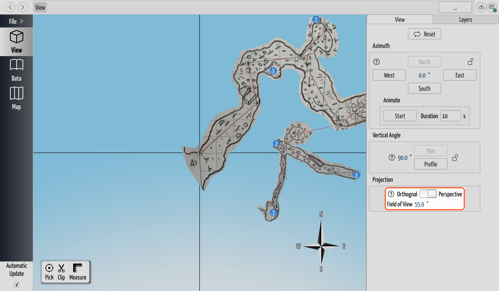

# Perspective and Field of View

## Why / when you need this

[The 3D View](the-3d-view.md) covers the everyday choice between the two
projections: **orthogonal** draws everything at one constant scale — the way a
finished map works — and **perspective** makes near passages larger than far
ones, the way your eye and a camera see. That page is enough for aiming a map.

This page is for what it doesn't cover: the **Field of View** setting that
appears once you're in perspective, which decides how wide the lens is. You reach
for it when you're building a view to *show* rather than to measure — a screenshot
for a trip report, a fly-through for a talk, or just a more readable sense of
depth while you find your bearings in a tangled cave.

## Switching projection

In the **View** tab's **Projection** group, Orthogonal and Perspective are the two
settings of a switch. The handle slides from one to the other — an animated
toggle, not a dial — and always lands on one end or the other; there's no in-between
state to hold.

Which one you're in changes two things elsewhere:

- The **[scale bar](the-3d-view.md#read-the-scene-compass-and-scale-bar)** shows
  in orthogonal only. In perspective there is no single scale that holds across
  the frame, so CaveWhere hides the bar rather than show a distance that means
  different things front to back.
- **Measuring and map export assume orthogonal.** Switch back to orthogonal to
  [measure](../measurement/measure-distance-and-bearing.md) or
  [export a map](../import-export/export-a-map.md) — those want true, undistorted
  proportions.

## Set the Field of View

**Field of View (FOV)** is the angle the perspective lens takes in — the same
idea as a wide-angle versus a telephoto lens on a camera. The control appears in
the Projection group **only while perspective is switched on**; in orthogonal
projection there is no lens angle to set, so the row is hidden.

*The Field of View row appears in the Projection group only once the slider
reaches Perspective. It sets the lens angle in degrees — here the 55° default.*

Type a value in degrees. The effect:

- A **low** FOV narrows the lens, which **zooms in** and flattens depth — distant
  and near passages end up closer to the same size, approaching how orthogonal
  looks. It's the telephoto end.
- A **high** FOV (toward 180°) takes in a very wide angle and exaggerates depth,
  eventually giving the bulging **fish-eye** look of an action camera.
- **55°** is the default and a good general-purpose value — close to a natural
  eye's field, so the cave looks the way you'd expect without either extreme.

The valid range is **0° to 180°**. Change it only when you want the effect on
purpose: a slightly lower FOV to calm the distortion in a tight fly-through, or a
higher one to fit a big room into a close shot.

## Which projection to use when

- **Orthogonal** — for anything that has to be *right*: measuring, exporting a
  map, comparing two trips at a matched scale, or a Plan/Profile that should read
  like a printed survey.
- **Perspective (around 55°)** — for anything that has to *communicate*:
  presenting the cave to your team, a video fly-through, or getting an intuitive
  feel for how passages stack in three dimensions.

## Where to go next

- **[The 3D View](the-3d-view.md)** — orbiting, the View panel's other controls,
  and the compass and scale bar this projection choice sits beside.
- **[Export a Map](../import-export/export-a-map.md)** — composing a map for
  paper, which works in orthogonal projection.
- **[Measure Distance and Bearing](../measurement/measure-distance-and-bearing.md)**
  — the measurement tool, another job that wants orthogonal projection.
