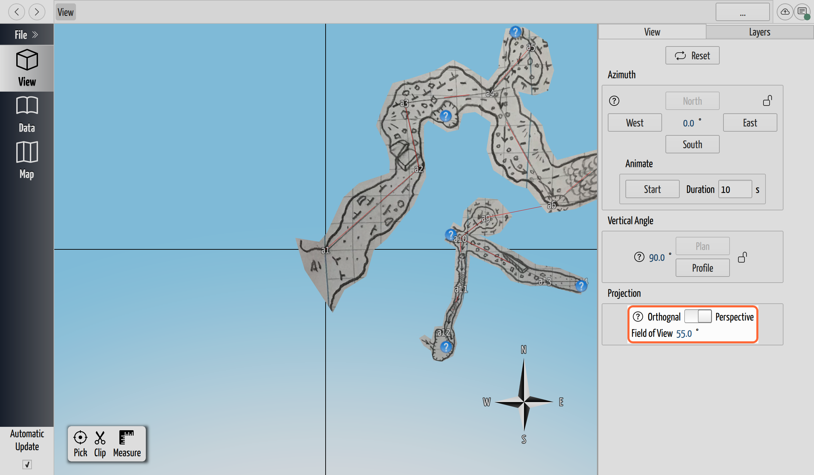

# Perspective and Field of View

## Why / when you need this

[The 3D View](the-3d-view.md) covers the everyday choice between the 2
projections. **Orthogonal** draws everything at one constant scale, the way a
finished map works. **Perspective** makes near passages larger than far ones,
the way your eye and a camera see. That page is enough for aiming a map.

This page covers what it does not: the **Field of View** row that appears once
you are in perspective. It sets the lens width. Reach for it when you build a
view that has to *show* the cave rather than measure it. A screenshot for a trip
report, a fly-through for a talk, a feel for depth in a tangled cave.

## Switching projection

The **View** tab's **Projection** group holds a switch with 2 settings. The app
labels the left one *Orthognal*, misspelled. Drag the handle and CaveWhere
blends the two projections live under your finger. Let go and it settles on
whichever end the handle is nearer, with exactly halfway counting as Orthogonal.
Clicking the track flips it outright. The blend reconciles the zoom when it
starts, so the cave holds its on-screen size across the switch.

The end you land on changes 3 things elsewhere:

- The **[scale bar](the-3d-view.md#read-the-scene-compass-and-scale-bar)** shows
  in orthogonal only. Perspective has no single scale that holds across the
  frame, so CaveWhere hides the bar rather than print a distance that means
  different things front to back.
- Perspective clips anything within **1 m** of the camera and anything past
  **10,000 m**. Orthogonal spans 10,000 m of depth each way and clips nothing up
  close, so a wall you fly into may vanish in perspective and stay put in
  orthogonal.
- **A map exported from perspective is still a perspective picture.** Nothing
  stops you. But an [exported map](../import-export/export-a-map.md) wants one
  scale everywhere, which perspective gives up. Measuring is the exception: the
  [measurement tool](../measurement/measure-distance-and-bearing.md) picks
  world-space points, so its distances and bearings read the same either way.

## Set the Field of View

**Field of View (FOV)** sets the angle the perspective lens takes in, the
wide-angle versus telephoto choice on a camera. The row shows up in the
Projection group only in perspective. Orthogonal has no lens angle to set, so
the row stays hidden.

*The Field of View row appears only once the toggle reaches Perspective. Here
it holds the 55.0° default.*

Click the blue number, shown above, and type degrees. CaveWhere eases into the
new angle over 200 ms instead of jumping. Clicking the words **Field of View**
unfolds the app's own note, whose second half runs together as shipped:

> The FOV is valid between 0.0° to 180.0°. A low FOV will make the view zoom in,
> while ahigh FOV (near 180) will give a fish eye effect. A good number for
> FOV is 55°

CaveWhere starts at **55.0°**, and I recommend leaving it there unless you want
the distortion on purpose: lower to calm a tight fly-through, higher to fit a
big room into a close shot.

Stay off both ends of that range. Nothing clamps the box, and the frustum
degenerates at the extremes: 0.0° blanks the plot, and past 180.0° it flips the
cave upside down. Type 55 back in to recover.

## Which projection to use when

- **Orthogonal** for anything that has to be *right*: measuring, exporting a
  map, comparing two trips at a matched scale, a Plan or Profile that should
  read like a printed survey.
- **Perspective at 55.0°** for anything that has to *communicate*: showing the
  cave to your team, a video fly-through, a feel for how passages stack in three
  dimensions.

## Where to go next

- **[The 3D View](the-3d-view.md)**: orbiting, the View panel's other controls,
  and the compass this projection choice sits beside.
- **[Export a Map](../import-export/export-a-map.md)**: composing a map for
  paper, which works in orthogonal.
- **[Measure Distance and Bearing](../measurement/measure-distance-and-bearing.md)**,
  another job that wants orthogonal.
