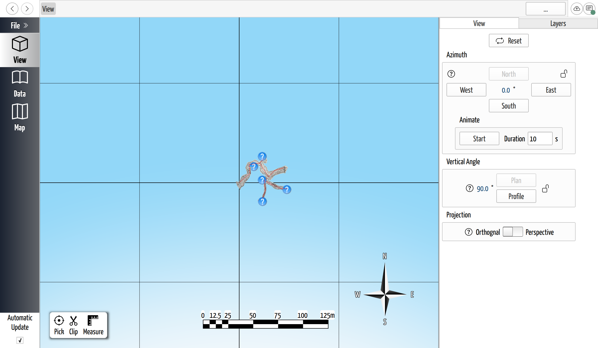
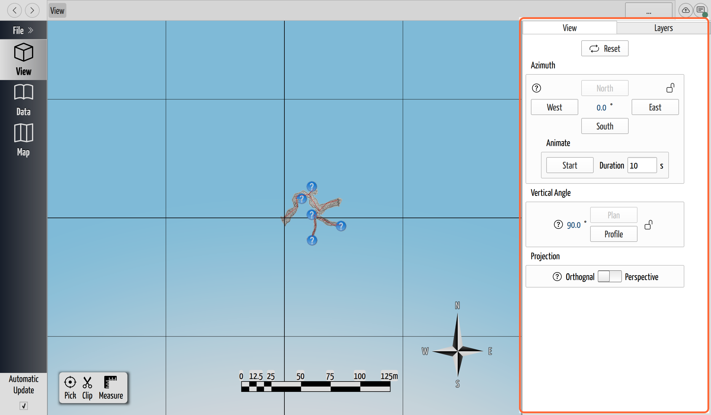
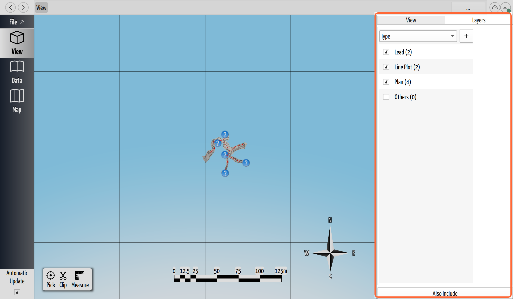

# The 3D View

## Why / when you need this

The 3D view is where CaveWhere earns its name. The moment you enter survey data,
the [shots](../concepts/glossary.md#shot) appear here as a 3D
[line plot](../concepts/glossary.md#loop-closure) you can orbit, zoom, and look
at from any angle — so you can see where the cave is actually heading, which
passages line up, and where the [leads](../concepts/glossary.md#lead) point
before you plan the next trip. This is the *living map* CaveWhere is built
around: it updates as you survey. (For the bigger picture, see
[Why CaveWhere](../concepts/why-cavewhere.md).)

*The 3D view. The red survey line plot runs through the carpeted passage
outlines; the compass rose (lower right) and scale bar (bottom) orient and size
the scene; the View panel on the right aims the camera.*

## Open the 3D view

Click **View** in the left navigation rail. CaveWhere opens the current region's
3D model. If nothing appears, you either have no survey data yet or the caves
aren't [georeferenced](../concepts/glossary.md#georeferencing) into the same
space — enter or fix some shots first.

## Move around: orbit, pan, and zoom

The 3D view is a *turntable*: the cave sits on an imaginary rotating table and
you look at it from the outside. With a mouse:

- **Orbit** (rotate around the cave) — **right-drag**.
- **Pan** (slide the view without rotating) — **left-drag**.
- **Zoom** — the **mouse wheel** or **trackpad scroll**.

On a touchscreen or trackpad, **drag with one finger to orbit** and **pinch to
zoom and pan**. Use these free gestures to explore; use the View panel below
when you need an *exact* angle for a screenshot or a map.

## Aim the camera precisely: the View panel

Free-hand orbiting is great for exploring but hard to reproduce. The **View**
tab of the side panel sets the camera to exact, repeatable angles — the same way
every time — which is what you want before exporting a view or comparing two
trips.

*The View panel aims the camera by exact angle rather than by dragging.*

- **Reset** returns the camera to a default framing of the whole cave — the fast
  way back when you've orbited yourself into a corner.
- **Azimuth** is the compass heading you're looking along. The **N / E / S / W**
  buttons snap to the cardinal directions, or type a value in the degree field.
  Setting azimuth to North gives you a map-style view oriented like a paper map.
  The **lock** keeps the heading fixed while you change other settings.
- **Vertical Angle** tilts between looking straight down and looking from the
  side. **Plan** (90°) is the straight-down, map-like view; **Profile** (0°) is
  a side-on elevation that shows how the cave climbs and drops. These are the two
  angles cave maps are traditionally drawn at, which is why they get dedicated
  buttons.
- **Projection** toggles between **Orthogonal** and **Perspective**. Orthogonal
  keeps distant passages the same size as near ones — the whole view is drawn at
  a single, constant scale with no perspective foreshortening. That is exactly
  how a finished cave map works, and it is what "map-like work" means here:

    - The **scale bar** applies everywhere in the frame, so you can judge a
      distance in the far part of the cave the same as the near part.
    - Passage widths and lengths stay in **true proportion** to each other,
      instead of near passages looking bigger just because they're closer to the
      camera.
    - A **Plan** or **Profile** view in orthogonal projection matches the
      convention printed cave maps are drawn in, so it reads — and exports — like
      a map rather than a photograph.

  **Perspective**, by contrast, makes near things larger and far things smaller,
  which looks more natural and gives a sense of depth — use it for presentation
  and getting your bearings, not for measuring.
- **Animate** spins the view over the number of seconds you set in **Duration** —
  a quick fly-around for showing the cave to others.

## Read the scene: compass and scale bar

Two aids are drawn into the scene itself:

- The **compass rose** (lower right) shows which way is north for the current
  camera, so you always know your orientation even after orbiting.
- The **scale bar** (bottom) shows real-world distance at the current zoom, so
  you can judge how big a passage or a gap actually is.

Both update live as you move the camera.

The scale bar appears **only in orthogonal projection**. In perspective there is
no single scale to show — near passages are drawn larger than far ones, so a bar
that means "50 m" in the foreground would mean something different in the
background. Rather than show a misleading measurement, CaveWhere hides the scale
bar until you switch back to orthogonal (see [Projection](#aim-the-camera-precisely-the-view-panel)).

## Focus on part of the cave: layers

A big project quickly becomes too much to look at all at once. The **Layers**
tab filters the scene by [keyword](../concepts/glossary.md#keyword), so you can
show only the parts you're working on and hide the rest — the same idea as
layers in a drawing program, but driven by the tags on your caves, trips, and
notes.

*The Layers tab groups the scene by keyword; untick a value to hide it.*

Pick a key (here, **Type**) and CaveWhere lists its values, each with a count.
Untick a value — say **Plan** — to hide those objects; tick it to bring them
back. You can narrow further by drilling down through more keys, and combine
independent selections with **Also Include**. See
[Focus the View with Keyword Layers](layers-and-keywords.md) for the full filter
— the AND columns that drill down and the OR groups that add selections together.

## Where to go next

- New to the terms used here (station, shot, lead, line plot)? See the
  [glossary](../concepts/glossary.md).
- Want the reasoning behind the always-current 3D map? Read
  [Why CaveWhere](../concepts/why-cavewhere.md).
- Measuring distances and bearings in the view, georeferencing, and rendering
  settings each get their own chapter as the manual grows (see
  [the manual index](../index.md)).
