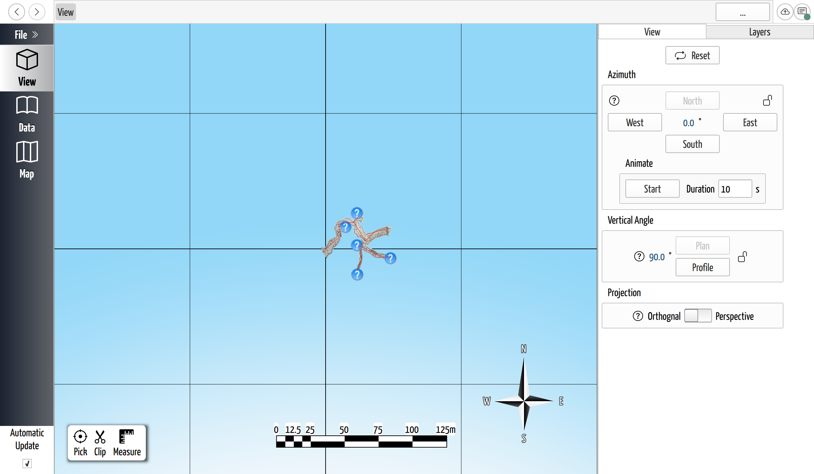
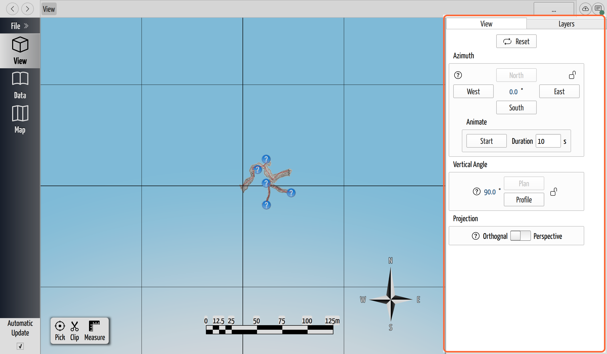
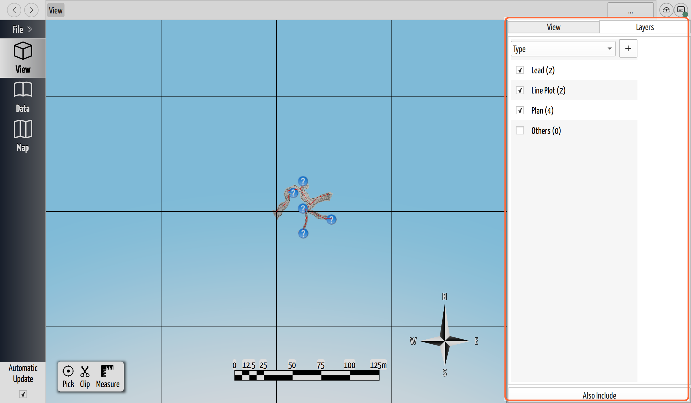

# The 3D View

## Why / when you need this

The 3D view is where CaveWhere earns its name. Type a shot into a trip and it
lands here in the [line plot](../concepts/glossary.md#loop-closure), which you
can orbit and zoom from any angle. Look and you see where the cave heads, which
passages line up, and where the [leads](../concepts/glossary.md#lead) point
before you plan the next trip. It updates as you survey, the argument
[Why CaveWhere](../concepts/why-cavewhere.md) makes at length.

*The 3D view in plan, looking straight down. The compass sits at the bottom
right with the scale bar to its left; the View panel on the right aims the
camera.*

## Open the 3D view

Click **View**, the cube icon in the left navigation rail. CaveWhere
opens the current region's 3D model. Nothing there? Either you have no survey
data yet, or the caves aren't
[georeferenced](../concepts/glossary.md#georeferencing) into the same space.
Enter or fix some shots first.

## Move around: orbit, pan, and zoom

The cave sits on an imaginary turntable and you look at it from the outside.
With a mouse:

- **Orbit** (rotate around the cave): **right-drag**. Every 2 pixels of drag
  turns the view 1°.
- **Pan** (slide the view without rotating): **left-drag**.
- **Zoom**: the **mouse wheel** or a **trackpad scroll**.

On a touchscreen, one finger drags to orbit and a pinch zooms and pans.

Orbiting does not spin around a fixed center. Right-press picks whatever sits
under the cursor and orbits *that*: an exact hit within 4 mm of the pointer, or
20 mm of reach for a scrap or centerline you nearly caught. Miss everything and
the old pivot stays put, so a stray click on empty sky will not teleport the
view. Sometimes the pivot lands wrong anyway; press again somewhere better.

## Aim the camera precisely: the View panel

Free-hand orbiting explores well but does not repeat. The **View** tab below
sets exact angles, what you want before exporting a view or comparing 2 trips.

*Every control that aims the camera. North and Plan are gray because the view
already holds 0.0° and 90.0°.*

- **Reset** animates back over 1 second and frames the *visible* geometry with
  an 8% margin. Hide half the project in **Layers** and Reset frames the half
  left showing, not the whole cave.
- **Azimuth** is the compass heading you look along, 0.0° to 360.0°. The
  **North**, **East**, **South**, and **West** buttons swing there over 200 ms;
  the button for the heading you already hold is grayed out. Or type a number.
  The **lock** freezes the heading so orbit drags can't move it.
- **Animate**, inside the Azimuth group, spins the heading in an endless loop.
  **Start** begins it; **Duration** sets the seconds per turn, 10 by default.
- **Vertical Angle** tilts between -90.0° and 90.0°. **Plan** snaps to 90°,
  straight down; **Profile** to 0°, a side-on elevation, and each grays out at
  its own angle. Cave maps are conventionally drawn at those 2 angles, hence the
  buttons.
- **Projection** is a switch running from Orthogonal (spelled "Orthognal" on
  screen) to **Perspective**. Orthogonal draws the whole frame at one constant
  scale, the way a printed map works. Perspective makes near passages larger
  than far ones. Drag the handle and the 2 blend live, though the switch
  settles onto whichever end is nearer the moment you let go. Perspective adds
  a **Field of View** row: see
  [Perspective and Field of View](perspective-and-field-of-view.md).

I recommend leaving the view orthogonal and switching to perspective only to
show the cave to somebody. Measuring and map export both want the constant
scale.

## Read the scene: compass and scale bar

The **compass rose** at the bottom right tumbles with the camera, so its N, S,
E, and W labels tell you which way you are facing after an orbit. The rose is a
readout and nothing else: it isn't clickable. To face north, use the Azimuth
buttons.

The **scale bar** sits to the compass's left, and only in orthogonal
projection. It rounds each cell to 1, 2, or 5 times a power of ten and draws 5
cells, the first split into quarters. That increment may change under you as
you zoom, so read the number, not the bar's width. Right-click the bar for a
**Metric** / **Imperial** menu, in which the entry matching the project's own
units is tagged *Project Default*.

Perspective has no single scale to print. A bar meaning 50 m in the foreground
would mean something else at the back of the cave, so CaveWhere hides the bar
until you switch back.

CaveWhere draws **station names** beside their points in the plot. Where
stations crowd together, or when you zoom out, it drops the overlapping labels
rather than print an unreadable pile, and holds the ones already on screen
steady so they don't flicker.

Not every station carries a name at once; zoom into a busy corner and more
appear. The labels ride the survey line, so hiding a trip's `Line Plot` in
[Layers](layers-and-keywords.md) hides its station names along with it. The
only switch for the labels themselves sits in
**File > Debug > Station Labels Visible**, an odd home for it.

## Focus on part of the cave: layers

A big project quickly becomes too much to look at all at once. The **Layers**
tab filters the scene by [keyword](../concepts/glossary.md#keyword) instead of
by a hand-built list of layers.

*The Layers tab groups the scene by keyword; untick a value to hide it.*

Pick a key (**Type**, shown above) and CaveWhere lists its values with a count:
`Lead (2)`, `Line Plot (2)`, `Plan (4)`, `Others (0)`. Untick one to hide those
objects, tick it to bring them back. **Also Include** adds a second,
independent selection. See
[Focus the View with Keyword Layers](layers-and-keywords.md) for drilling down
through AND columns and combining groups with OR.

## Where to go next

- The floating toolbar at the bottom left holds **Pick**, **Clip**, and
  **Measure**. Measure reports the
  [distance and bearing](../measurement/measure-distance-and-bearing.md)
  between 2 points, and Clip trims a
  [point cloud](../point-clouds/clip-a-point-cloud.md). Each one takes over
  left-click until you click it off again.
- The blue `?` balloons floating over the plot are
  [leads](../leads/track-and-export-leads.md).
- Unsure of a term? The [glossary](../concepts/glossary.md) covers station,
  shot, lead, and line plot.
