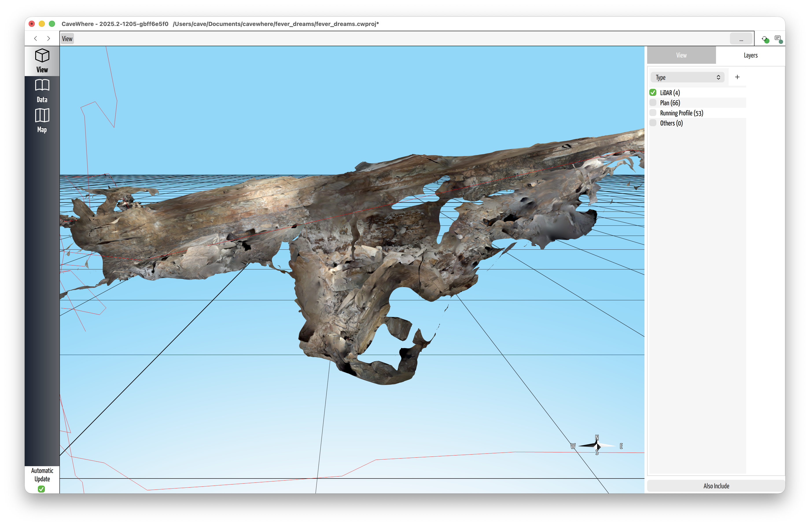
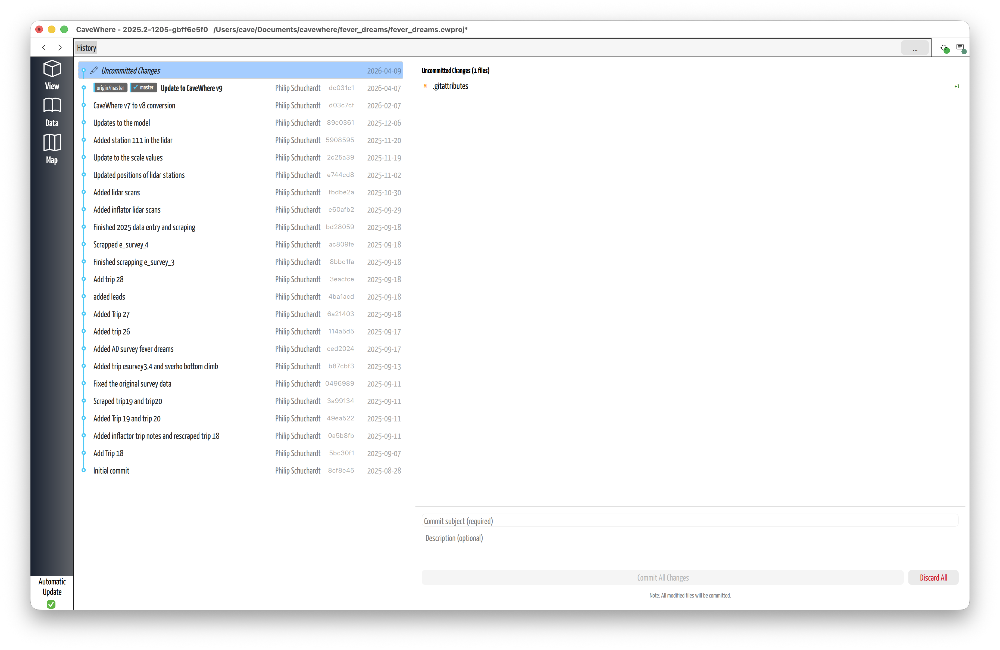
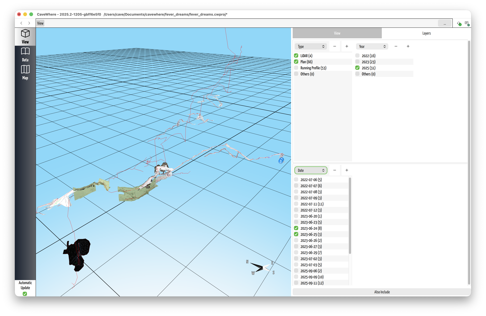
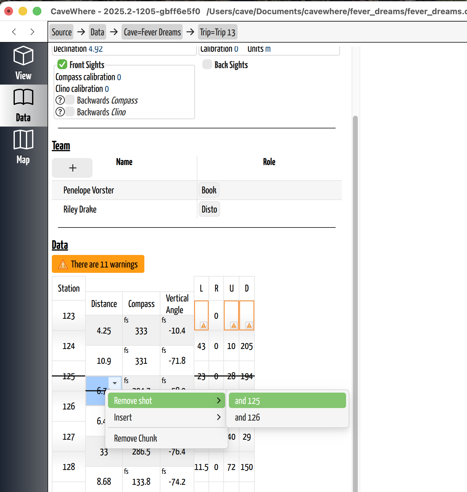
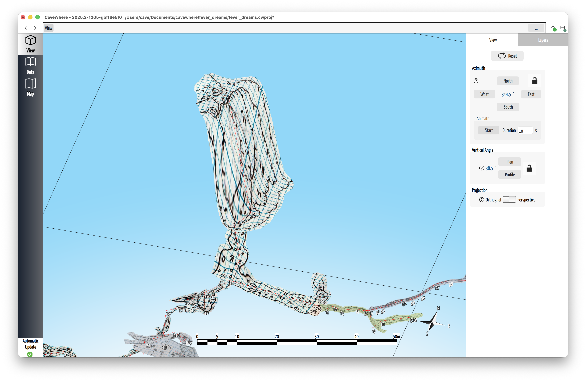

# CaveWhere 2026.4 Release Notes

**CaveWhere 2026.4** is the biggest release in CaveWhere's history — over 1,200 commits across 14 months bringing three transformative features: **LiDAR note support**, **Git Sync for team collaboration**, and **keyword filtering with layer visibility** (one of the most requested features), alongside a redesigned survey editor, dark mode, and much more.

---

## LiDAR Notes

Cave surveying has traditionally relied on hand-drawn sketches to capture passage shape. LiDAR changes that — you can now scan a passage in seconds and bring that 3D data directly into your survey project, capturing detail that could take hours to sketch by hand.

CaveWhere now supports importing 3D LiDAR scans and photogrammetry models directly into your trip notes. Scan a passage with your phone using apps like Polycam, export as glTF/GLB, and drop it into CaveWhere alongside your traditional sketched notes. Any iPhone 12 Pro or newer (Pro models with the LiDAR depth camera) or iPad Pro (2020+) can capture scans in the cave.

Photogrammetry models work too — any 3D model in glTF (.glb) format can be imported, scaled, and morphed into the cave, whether it came from LiDAR or photogrammetry.

- **Full 3D rendering** of glTF/GLB models inside the note gallery
- **Interactive calibration tools** — tie scans to survey stations, set north orientation, calibrate scale, and define the vertical axis
- **Two-point transform** for quick alignment of scans to your survey
- **Auto north-up rotation** orients scans automatically
- **LiDAR and photogrammetry morphing** — 3D scan data morphs into the cave model just like sketched scraps, creating rich 3D passage geometry
- **Multiple scans per trip** supported on the map
- **Keyword integration** — LiDAR notes are tagged with their filename for easy filtering
- **Full save/load and sync support** — scan data persists in the project file and syncs through Git

See it in action:
- [LiDAR scanning in CaveWhere](https://www.youtube.com/shorts/DPfwFr5nGZw)
- [Enhancing 2D drawings with LiDAR](https://www.youtube.com/watch?v=pUV4126cisk&t=2s)
- [Photogrammetry import and scaling](https://www.youtube.com/watch?v=sfTYUjLAYWo&t=3s)

---

## Git Sync

Cave surveys are a team effort, but sharing project files has always been a pain — emailing files back and forth, worrying about overwriting each other's work, or losing changes. Git Sync solves this by letting multiple cavers work on the same project and merge their changes together automatically.

Git Sync also lays the groundwork for CaveWhere's mobile future. When CaveWhere runs on phones and tablets for in-cave digital survey, sync becomes essential — survey teams can capture data on multiple devices underground and merge everything together when they return to the surface. This release builds the foundation that makes that workflow possible.

CaveWhere now includes a complete Git-based sync system with GitHub integration.

### GitHub Integration
- **One-click GitHub login** via OAuth device flow — no SSH keys required
- **Create repositories** directly from CaveWhere
- **Secure credentials** stored via the system keychain
- **Multi-account support** — manage multiple GitHub accounts and switch between them

### Sync Engine
- **Smart 3-way merge** for every data type — caves, trips, survey chunks, notes, scraps, LiDAR, teams, and more
- **Conflict resolution** that understands CaveWhere's data model, not just text
- **Incremental sync** — only changed data is transferred
- **Version compatibility** — sync warns you when a pulled project requires a newer version of CaveWhere
- **Restore-to-version** — roll back to any previous project state

### Sharing
- **`cavewhere://` deep links** — share a link to your project that opens directly in CaveWhere (macOS and Windows)
- **Share dialog** for generating project links
- **Clone from URL** with progress UI

See it in action:
- [How to add a remote](https://www.youtube.com/watch?v=8quclHJzoY4)
- [Intro to Sync'ing](https://www.youtube.com/watch?v=yjSAmIzwOXM)

### Sync UI

- **Sync button** in the toolbar with status indicator and local-change badge
- **Git history page** showing the full history of changes to your project
- **File diff viewer** showing exactly what changed between versions
- **Image comparison** with drag-divider for changed note images
- **Save & Sync on close** — option to sync before quitting

---

## Keyword Filtering and Layers

One of the most requested features is here. As cave projects grow to dozens of trips and hundreds of survey stations, it becomes hard to focus on the area you're working on. Keywords and layers let you organize your project and control exactly what's visible in the 3D view.

- **Tag everything** — caves, trips, teams, notes, LiDAR notes, and scraps all support keywords
- **Filter pipeline** with AND/OR grouping for complex queries
- **Keyword tab** for browsing and selecting keywords across your project
- **Layer visibility control** — show or hide entities by keyword, making it easy to focus on specific parts of a large cave system

---

## Redesigned Survey Editor

Paper surveyors spend most of their CaveWhere time entering data. The survey editor has been completely rebuilt for speed and usability — and these improvements also lay the groundwork for future mobile versions of CaveWhere that will support digital in-cave survey.

- **Full keyboard navigation** — Tab, arrow keys, beginning/end of row for fast data entry without touching the mouse
- **Context menus** on stations and shots — insert rows, delete rows, remove chunks with visual preview
- **Specialized input components** for clino readings, distance, and station names
- **Typed reading values** — compass, clino, and distance readings are now strongly typed, catching errors earlier
- **Duplicate station warnings** and unconnected chunk error messages
- **Smart chunk trimming** that only activates when data changes

---

## Dark Mode and Theming

Long mapping sessions in dim lighting (or late-night data entry) are much easier on the eyes now.

 

- **Dark mode** enabled application-wide
- **Appearance settings** — configure fonts through the settings UI
- **Consistent styling** across the entire application

See it in action: [Dark mode support](https://www.youtube.com/watch?v=wQhnackWvVc)

---

## New Project Format

CaveWhere introduces two new project formats, designed around three goals:

1. **Safety against data loss** — cave survey data takes enormous time and money to collect. Losing it is not an option. The new formats use atomic saves, full version history, and Git-backed storage to protect your work.
2. **Human-readable and machine-parseable** — project files are friendly to both computers and humans. You can inspect, script against, or recover raw data without needing CaveWhere.
3. **Portability** — a single bundled file for small caves or quick sharing, and a directory format for large collaborative projects.

- **`.cwproj` directory format** — the new default, human-readable and machine-parseable, Git-backed for collaboration and sync
- **Bundled `.cw` format** — a zip archive for single-file sharing and distribution, stores full history so it also works with sync
- **Automatic legacy conversion** — old `.cw` files (JSON + SQLite) are converted on open. **This conversion is one-way — back up your original files before opening them in CaveWhere 2026.4.**
- **Per-entity versioning** — ensures forward compatibility as the format evolves
- **Atomic saves** — rapid edits are batched together to avoid data loss (`.cwproj` only)
- **Modified tracking** — dirty indicator in the title bar and macOS close button dot so you always know when you have unsaved changes

See it in action: [New project format](https://youtu.be/lbxvMPZuHEM)

---

## Rendering Improvements

- **3D label system** with priority-based culling and smooth animation — station labels stay readable even in dense cave systems
- **Scale bar** in each capture viewport
- **Centerline rendering** improvements
- **Cross-platform shader fixes** for Windows and Linux

See it in action: [3D label system](https://www.youtube.com/watch?v=ib6c1LUzI0A)

---

## Warping and Morphing

CaveWhere's signature feature — morphing 2D sketches into 3D cave models — has been improved.

- **Configurable warping settings** with z-blending controls for fine-tuning how sketches wrap around passage shapes
- **Warping settings UI** with persistence and reset-to-default
- **Declination fix** for morphing with manual scrap transformations

See it in action: [Warping and morphing](https://www.youtube.com/watch?v=L8yNsDQamLU&t=1s)

---

## Import and Export

- **Compass import fixes** — backsight parsing, LRUD handling, UP/DOWN directions, missing values
- **CSV lead export** — export leads to CSV for use in other tools
- **Survex export fixes** — survey name handling, skip empty surveys
- **SVG import** — proper DPI handling, transparent backgrounds, high-DPI alignment
- **PDF import** — resolution and scaling fixes
- **Image deduplication** — duplicate note images are detected and prevented
- **Exif transformation** support for imported images
- **Splay shots** ignored on import
- **Lead improvements** — dimension fields preserve unset state and block negative values, lead info editor shown when a lead overlaps an outline point
- **Survex upgraded** to 1.4.17

---

## Platform Support

- **Linux AppImage** — full AppImage packaging for easy installation
- **Windows** — improved stability and shader fixes
- **macOS** — Qt 6.11 support
- **`.cwproj` registered** as a CaveWhere file type on all platforms

---

## Quality of Life

- **Graceful shutdown** — no more crashes on close, with a progress screen during cleanup
- **Save guards** on all project-switching flows (File > Open, recent projects, clone)
- **Welcome page** for new users
- **Breadcrumb navigation** fixes across all pages
- **Stay on page** when opening a new project
- **Recent project** management with stale entry cleanup

---

## Performance

- Faster 3D label rendering
- Geometry intersection speedup
- Survey editor performance improvements
- Cached scaled images for note icons
- Saves are batched during rapid editing to reduce disk writes

---

## Bug Fixes

Over 350 bug fixes, including:

- Fix trip deletion removing the wrong trip when the table is sorted
- Fix stale trip page shown after opening a recent project
- Fix merge conflicts silently deleting files
- Fix duplicate entries when cloning a project
- Fix passage walls disappearing after loading a bundled project
- Fix new project not clearing the centerline
- Fix carpet menu going blank

---

## Dependencies

- Qt 6.11
- Protobuf 6.32.1
- libgit2 1.9.1
- OpenSSL 3.5.0
- Survex 1.4.17
